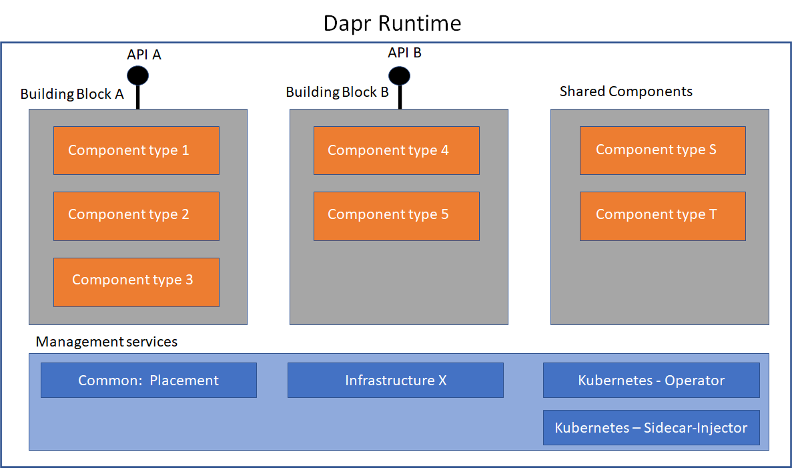

# Concepts

The core Dapr concepts are covered here, to get you familiar with these are used in the Dapr runtime. This directory also contains deeper conceptual topics to expand your understanding on the [Dapr API reference](https://github.com/dapr/docs/tree/master/reference/api). 

## Core concepts
* **Application** - A running instance of user code that has a single instance of Dapr running as a sidecar (process or container)

* **Service** - An alternative name for a Dapr application, when the scope of the application is broader than looking at a single instance of the user code.

*   [**Reference API**](https://github.com/dapr/docs/tree/master/reference/api) - An abstraction for a distributed system capability 


*  **Building Blocks**
    
    A collection of component types that implement a reference API. New building blocks can be added by defining a new API. The list of Dapr building blocks in the alpha runtime
    release is;

    * [**Actors**](./actor/actor_overview.md)
    A pattern for stateful and stateless objects that make concurrency simple with method and state encapsulation. Dapr provides [many capabilities in its actor runtime](./actor/actors_features.md) including concurrency, state, life-cycle management for actor activation/deactivation and timers and reminders to wake-up actors

    * [**Pub-sub**](./publish-subscribe-messaging/pub-sub-messaging.md) Pub-sub is a loosely coupled messaging pattern where senders (or publishers) publish messages to a topic, to which subscribers subscribe. 

    * [**Service Invocation**](./service-invocation/Readme.md) Resilient service-to-service invocation enables method calls, including retries, on remote services wherever they are running in the supported hosting environment.

    * [**State**](./state-management/state-management.md) Application state is anything an application wants to perserve beyound a single session. Dapr allows pluggable state stores behind a key/value-based state API.

    * [**Resource Bindings**](./bindings/Readme.md) A binding provides defines a bi-directional connection to an external cloud/on-premise service or system. Dapr allows you to invoke the external service through the standard Dapr binding API, and it allows your application to be triggered by events sent by the bound service.

    * [**Distributed Tracing**](./tracing-logging/tracing-logging.md) Distirbuted tracing collects and aggregates trace events by transactions. It allows you to trace the entire call chain across multiple services. Dapr integrates with [OpenTelemetry](https://opentelemetry.io/) for distributed tracing and metrics collection. 

* [**Components**](./components/redis.md)
  
  Dapr uses a modular design, in which functionality is  delivered by **component types**.  

    * **Component type** - An implementation of the building block API for a technology. The building block can be considered as a namespace for the component type. Component types are pluggable so that you can swap out implementations of the same type. An example is the [pub-sub component for Redis](./components/redis.md) 

    * **Shared component type** - A component that is in a shared namespace and does not implement an API from a building block. An example is the [secrets](./components/secrets.md) component.

        * [**Secrets**](./components/secrets.md)
            In Dapr, a secret is any piece of private information that you want to guard against unwanted users. Dapr provides a secrets API and integrates with secret stores such as Azure Key Vault and Kubernetes secret stores to store the secrets.

    * **Component instance** - A running instance of a component type.
    
    * **Component instance definition** - A YAML configuration file for a component instance that has other components instances injected at runtime. This enables a component to use other components. Examples. A secret component instance can be injected into the state store component instance. A state store component can be injected into the pub/sub component for persistent

* **Management services**

    Infrastructure services that are used by components.

    * **Common services** – Services that are deployed and started for all infrastructures
    
        * *Placement service* - A service that performs actor instance partition resolution.

	* **Infrastructure X services** – Services that are deployed and started on an infrastructure X deployment e.g. Kubernetes, Service Fabric, IoT Edge, Swarm, VMs etc. In this alpha release only Kubernetes is supported.

    	* **Kubernetes services** – Services that are deployed and started on a Kubernetes deployment.
            * *Operator service* - Understands the Dapr annotations shown below, allocating the dapr.io/id to the application instance and telling Dapr runtime the application dapr.io/port to listen on

            ```bash
            template:
                metadata:
                annotations:
                    dapr.io/enabled: "true"
                    dapr.io/id: "nodeapp"
                    dapr.io/port: "3000"
            ```
            * *Sidecar-injector service* -Starts an instance of Dapr runtime for each application instance running in pod

## Core Concept Diagram
The diagram below illustrates the relationship between Dapr concepts, showing how Dapr building blocks are a collection of component types. Component types and shared components can be injected into any running component instance through the component instance YAML definition.

Management services are used to integrate Dapr with an infrastructure platform and include common services that run on all platform and platform specific services.

