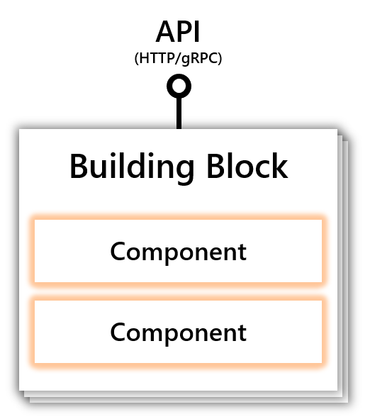

# Dapr concepts

The goal of these topics is to provide an understanding of the key concepts used in the Dapr documentation.

## Contents

  - [Building blocks](#building-blocks)
  - [Components](#components)
  - [Configuration](#configuration)
  - [Secrets](#secrets)
  - [Hosting environments](#hosting-environments)

## Building blocks

A [building block](./architecture/building_blocks.md) is as an HTTP or gRPC API that can be called from user code and uses one or more Dapr components. Dapr consists of a set of building blocks, with extensibility to add new building blocks.

The diagram below shows how building blocks expose a public API that is called from your code, using components to implement the building blocks' capability.

  
The following are the building blocks provided by Dapr:

| Building Block | Endpoint | Description |
|----------------|----------|-------------|
| [**Service-to-Service Invocation**](./service-invocation/README.md) | `/v1.0/invoke` | Service invocation enables applications to communicate with each other through well-known endpoints in the form of http or gRPC messages. Dapr provides an endpoint that acts as a combination of a reverse proxy with built-in service discovery, while leveraging built-in distributed tracing and error handling.
| [**State Management**](./state-management/README.md) | `/v1.0/state` | Application state is anything an application wants to preserve beyond a single session. Dapr provides a key/value-based state API with pluggable state stores for persistence.
| [**Publish and Subscribe**](./publish-subscribe-messaging/README.md) | `/v1.0/publish` `/v1.0/subscribe`|  Pub/Sub is a loosely coupled messaging pattern where senders (or publishers) publishes messages to a topic, to which subscribers subscribe. Dapr supports the pub/sub pattern between applications.
| [**Resource Bindings**](./bindings/README.md)| `/v1.0/bindings` | A binding provides a bi-directional connection to an external cloud/on-premise service or system. Dapr allows you to invoke the external service through the  Dapr binding API, and it allows your application to be triggered by events sent by the connected service.
| [**Actors**](./actors/README.md) | `/v1.0/actors` |  An actor is an isolated, independent unit of compute and state with single-threaded execution. Dapr provides an actor implementation based on the Virtual Actor pattern which provides a single-threaded programming model and where actors are garbage collected when not in use. See * [Actor Overview](./actors#understanding-actors)
| [**Observability**](./observability/README.md) | `N/A` |  Dapr system components and runtime emit metrics, logs, and traces to debug, operate and monitor Dapr system services, components and user applications.
| [**Secrets**](./secrets/README.md) | `/v1.0/secrets` | Dapr offers a secrets building block API and integrates with secret stores such as Azure Key Vault and Kubernetes to store the secrets. Service code can call the secrets API to retrieve secrets out of the Dapr supported secret stores.

## Components
 
Dapr uses a modular design where functionality is delivered as a component. Each component has an interface definition.  All of the components are pluggable so that you can swap out one component with the same interface for another. The [components contrib repo](https://github.com/dapr/components-contrib) is where you can contribute implementations for the component interfaces and extends Dapr's capabilities.
  
 A building block can use any combination of components. For example the [actors](./actors) building block and the state management building block both use state  components.  As another example, the pub/sub building block uses [pub/sub](./publish-subscribe-messaging/README.md) components.

 You can get a list of current components available in the current hosting environment using the `dapr components` CLI command.

 The following are the component types provided by Dapr:

* [Service discovery](https://github.com/dapr/components-contrib/tree/master/nameresolution)
* [State](https://github.com/dapr/components-contrib/tree/master/state)
* [Pub/sub](https://github.com/dapr/components-contrib/tree/master/pubsub)
* [Bindings](https://github.com/dapr/components-contrib/tree/master/bindings)
* [Middleware](https://github.com/dapr/components-contrib/tree/master/middleware)
* [Secret stores](https://github.com/dapr/components-contrib/tree/master/secretstores)
* [Tracing exporters](https://github.com/dapr/components-contrib/tree/master/exporters)

### Service invocation and service discovery components
Service discovery components are used with the [Service Invocation](./service-invocation/README.md) building block to integrate with the hosting environment to provide service-to-service discovery. For example, the Kubernetes service discovery component integrates with the kubernetes DNS service and self hosted uses mDNS.

### Service invocation and middleware components  
Dapr allows custom [**middleware**](./middleware/README.md) to be plugged into the request processing pipeline. Middleware can perform additional actions on a request, such as authentication, encryption and message transformation before the request is routed to the user code, or before the request is returned to the client. The middleware components are used with the [Service Invocation](./service-invocation/README.md) building block.

### Secret store components
In Dapr, a [**secret**](./secrets/README.md) is any piece of private information that you want to guard against unwanted users. Secretstores, used to store secrets, are Dapr components and can be used by any of the building blocks.

## Configuration

Dapr [Configuration](./configuration/README.md) defines a policy that affects how any Dapr sidecar instance behaves, such as using [distributed tracing](./observability/traces.md) or a [middleware component](./middleware/README.md). Configuration can be applied to Dapr sidecar instances dynamically.

 You can get a list of current configurations available in the current the hosting environment using the `dapr configurations` CLI command.
  
## Hosting environments

Dapr can run on multiple hosting platforms. The supported hosting platforms are:

* [**Self hosted**](./hosting/README.md#running-dapr-on-a-local-developer-machine-in-standalone-mode). Dapr runs on a single machine either as a process or in a container. Used for local development or running on a single machine execution 
* [**Kubernetes**](./hosting/README.md#running-dapr-in-kubernetes-mode). Dapr runs on any Kubernetes cluster either from a cloud provider or on-premises.
