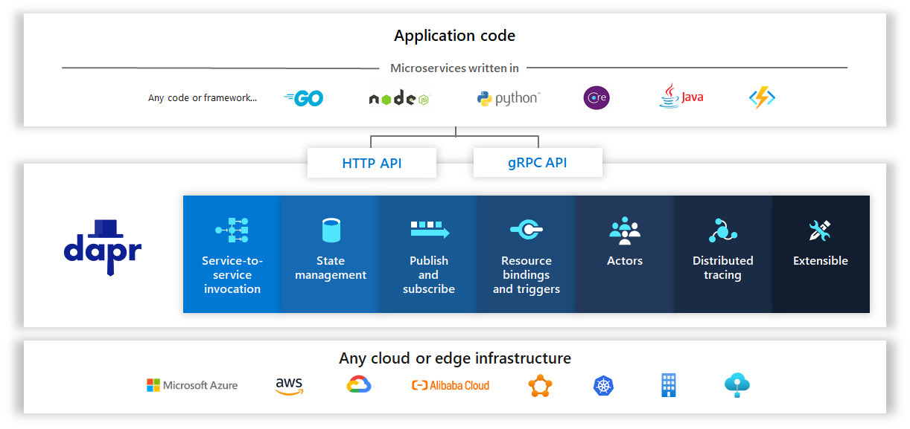

# Building blocks

Dapr consists of a set of building blocks that can be called from any programming language through Dapr HTTP or gRPC APIs. These building blocks address common challenges in building resilient, microservices applications. And they capture and share best practices and patterns that empower distributed application developers.

## Anatomy of a building block

Both Dapr spec and Dapr runtime are designed to be extensible
to include new building blocks. A building block is comprised of the following artifacts:

* Dapr spec API definition. A newly proposed building block shall have its API design incorporated into the Dapr spec.
* Components. A building block may reuse existing [Dapr components](../README.md#components), or introduce new components.
* Test suites. A new building block implementation should come with associated unit tests and end-to-end scenario tests.
* Documents and samples.
