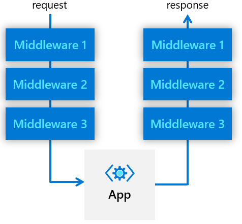

# Middleware pipeline

Dapr allows custom processing pipelines to be defined by chaining a series of middleware components. A request goes through all defined middleware components before it's routed to user code, and then goes through the defined middleware, in reverse order, before it's returned to the client, as shown in the following diagram.



## Customize processing pipeline

When launched, a Dapr sidecar constructs a middleware processing pipeline. By default the pipeline consists of [tracing middleware](../observabilty/traces.md) and CORS middleware. Additional middleware, configured by a Dapr [configuration](../configuration/README.md), can be added to the pipeline in the order they are defined. The pipeline applies to all Dapr API endpoints, including state, pub/sub, service invocation, bindings, security and others.

> **NOTE:** Dapr provides a **middleware.http.uppercase** pre-registered component that changes all text in a request body to uppercase. You can use it to test/verify if your custom pipeline is in place.

The following configuration example defines a custom pipeline that uses a [OAuth 2.0 middleware](../../howto/authorization-with-oauth/README.md) and an uppercase middleware component. In this case, all requests are authorized through the OAuth 2.0 protocol, and transformed to uppercase text, before they are forwarded to user code.

```yaml
apiVersion: dapr.io/v1alpha1
kind: Configuration
metadata:
  name: pipeline
spec:
  httpPipeline:
    handlers:
    - name: oauth2
      type: middleware.http.oauth2
    - name: uppercase
      type: middleware.http.uppercase
```

## Writing a custom middleware

Dapr uses [FastHTTP](https://github.com/valyala/fasthttp) to implement it's HTTP server. Hence, your HTTP middleware needs to be written as a FastHTTP handler. Your middleware needs to implement a middleware interface, which defines a **GetHandler** method that returns a **fasthttp.RequestHandler**:

```go
type Middleware interface {
  GetHandler(metadata Metadata) (func(h fasthttp.RequestHandler) fasthttp.RequestHandler, error)
}
```

Your handler implementation can include any inbound logic, outbound logic, or both:

```go
func GetHandler(metadata Metadata) fasthttp.RequestHandler {
  return func(h fasthttp.RequestHandler) fasthttp.RequestHandler {
    return func(ctx *fasthttp.RequestCtx) {
      //inboud logic
            h(ctx)  //call the downstream handler
            //outbound logic
    }
  }
}
```

## Submitting middleware components
Your middleware component can be contributed to the https://github.com/dapr/components-contrib repository, under the */middleware* folder. Then submit another pull request against the https://github.com/dapr/dapr repository to register the new middleware type. You'll need to modify the **Load()** method under https://github.com/dapr/dapr/blob/master/pkg/components/middleware/http/registry.go to register your middleware using the **Register** method.

## References
* [How-To: Configure API authorization with OAuth](../../howto/authorization-with-oauth/readme.md)