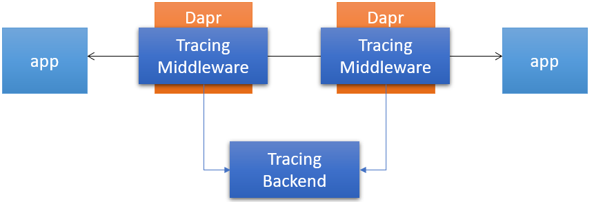

# Distributed Tracing

Dapr uses OpenTelemetry (previously known as OpenCensus) for distributed traces and metrics collection. OpenTelemetry supports various backends including [Azure Monitor](https://azure.microsoft.com/en-us/services/monitor/), [Datadog](https://www.datadoghq.com), [Instana](https://www.instana.com), [Jaeger](https://www.jaegertracing.io/), [SignalFX](https://www.signalfx.com/), [Stackdriver](https://cloud.google.com/stackdriver), [Zipkin](https://zipkin.io) and others.



## Contents

- [Tracing Design](#tracing-design)
- [Correlation ID](#correlation-id)
- [Configuration](#configuration)
- [References](#references)

## Tracing design

Dapr adds a HTTP/gRPC middleware to the Dapr sidecar. The middleware intercepts all Dapr and application traffic and automatically injects correlation IDs to trace distributed transactions. This design has several benefits:

* No need for code instrumentation. All traffic is automatically traced (with configurable tracing levels).
* Consistent tracing behavior across microservices. Tracing is configured and managed on Dapr sidecar so that it remains consistent across services made by different teams and potentially written in different programming languages.
* Configurable and extensible. By leveraging OpenTelemetry, Dapr tracing can be configured to work with popular tracing backends, including custom backends a customer may have.
* OpenTelemetry exporters are defined as first-class Dapr components. You can define and enable multiple exporters at the same time.

## Correlation ID

Dapr uses the standard W3C Trace Context headers. For HTTP requests, Dapr uses `traceparent` header.For gRPC requests, Dapr uses `grpc-trace-bin` header.When a request arrives without a trace ID, Dapr creates a new one. Otherwise, it passes the trace ID along the call chain.

## Configuration

Dapr uses [probalistic sampling](https://opencensus.io/tracing/sampling/probabilistic/) as defined by OpenCensus. The sample rate defines the probaility a tracing span will be sampled and can have a value between 0 and 1 (inclusive). The deafault sample rate is 0.0001 (i.e. 1 in 10,000 spans is sampled).

To change the default tracing behavior, use a configuration file (in self hosted mode) or a Kubernetes configuration object (in Kubernetes mode). For example, the following configuration object changes the sample rate to 1 (i.e. every span is sampled):

```yaml
apiVersion: dapr.io/v1alpha1
kind: Configuration
metadata:
  name: tracing
  namespace: default
spec:
  tracing:
    samplingRate: "1"
```

Similarly, changing `samplingRate` to 0 will disable tracing altogether.

See the [References](#references) section for more details on how to configure tracing on local environment and Kubernetes environment.

Dapr supports pluggable exporters, defined by configuration files (in self hosted mode) or a Kubernetes custom resource object (in Kubernetes mode). For example, the following manifest defines a Zipkin exporter:

```yaml
apiVersion: dapr.io/v1alpha1
kind: Component
metadata:
  name: zipkin
  namespace: default
spec:
  type: exporters.zipkin
  metadata:
  - name: enabled
    value: "true"
  - name: exporterAddress
    value: "http://zipkin.default.svc.cluster.local:9411/api/v2/spans"
```

## References

* [How-To: Set up Application Insights for distributed tracing](../../howto/diagnose-with-tracing/azure-monitor.md)
* [How-To: Set up Zipkin for distributed tracing](../../howto/diagnose-with-tracing/zipkin.md)
