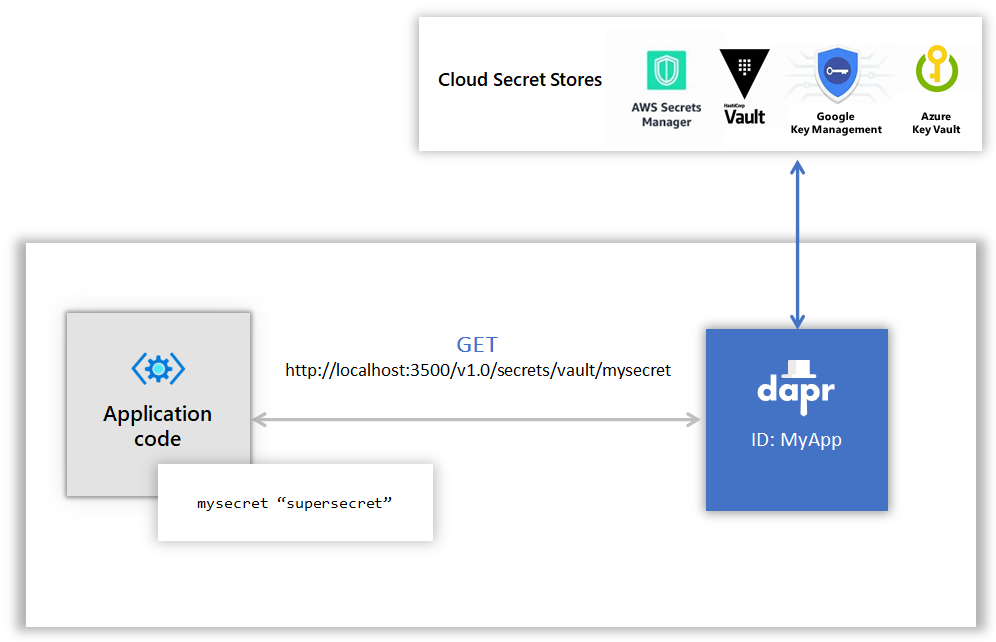
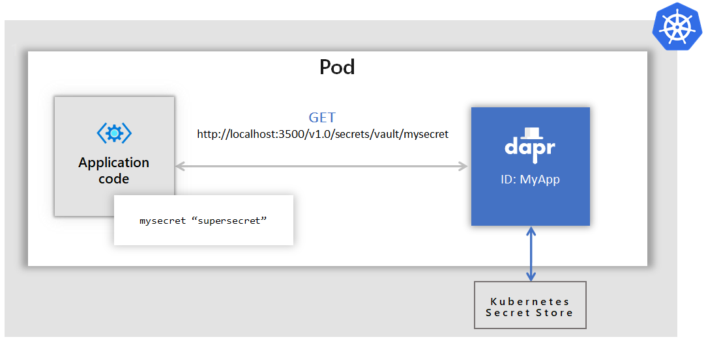
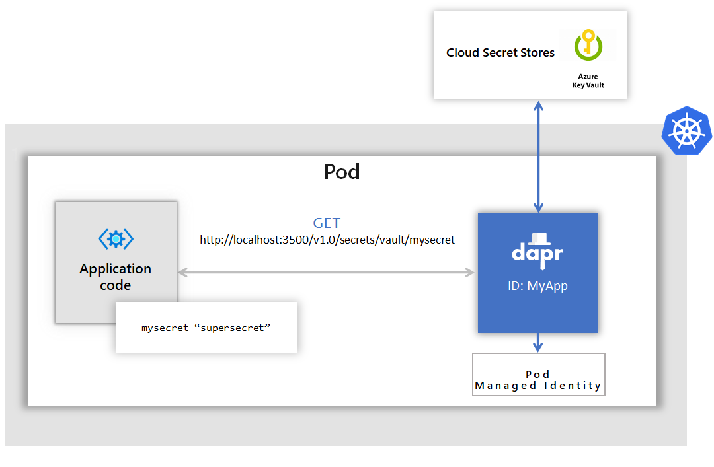

# Dapr secrets management

Dapr offers developers a consistent way to extract application secrets, without needing to know the specifics of the secret store being used.
Secret stores are components in Dapr. Dapr allows users to write new secret stores component implementations that can be used both to hold secrets for other Dapr components (for example secrets used by a state store components to read/write state) as well as serving the application with a dedicated secret building block API. Using the secrets building block API, you can easily read secrets that can be used by the application from a named secrets store. 

Some examples for secret stores include `Kubernetes`, `Hashicorp Vault`, `Azure KeyVault`. See [secret stores](https://github.com/dapr/components-contrib/tree/master/secretstores) for the list of supported stores.

See [Setup secret stores](https://github.com/dapr/docs/tree/master/howto/setup-secret-store) for a HowTo guide for setting up and using secret stores.

## Referencing secret stores in Dapr components

Instead of including credentials directly within a Dapr component file, you can place the credentials within a Dapr supported secret store and reference the secret within the Dapr component. This is preferred approach and is a recommended best practice especially in production environments. 

For more information read [Referencing Secret Stores in Components](./component-secrets.md)

## Using secrets in your application

Application code can call the secrets building block API to retrieve secrets from Dapr supported secret stores that can be used in your code.
Watch this [video](https://www.youtube.com/watch?v=OtbYCBt9C34&t=1818) for an example of how the secrets API can be used in your application.

For example, the diagram below shows an application requesting the secret called "mysecret" from a secret store called "vault" from a configured cloud secret store.

Applications can use the secrets API to access secrets from a Kubernetes secret store. In the example below, the application retrieves the same secret "mysecret" from a Kubernetes secret store.  

In Azure Dapr can be configured to use Managed Identities to authenticate with Azure Key Vault in order to retrieve secrets. In the example below, an Azure Kubernetes Service (AKS) cluster is configured to use managed identities. Then Dapr uses [pod identities](https://docs.microsoft.com/en-us/azure/aks/operator-best-practices-identity#use-pod-identities) to retrieve secrets from Azure Key Vault on behalf of the application. 

Notice that in all of the examples above the application code did not have to change to get the same secret. Dapr did all the heavy lifting here via the secrets building block API and using the secret components.

See [Access Application Secrets using the Secrets API](https://github.com/dapr/docs/tree/master/howto/get-secrets) for a How To guide to use secrets in your application.

For detailed API information read [Secrets API](https://github.com/dapr/docs/blob/master/reference/api/secrets_api.md).

