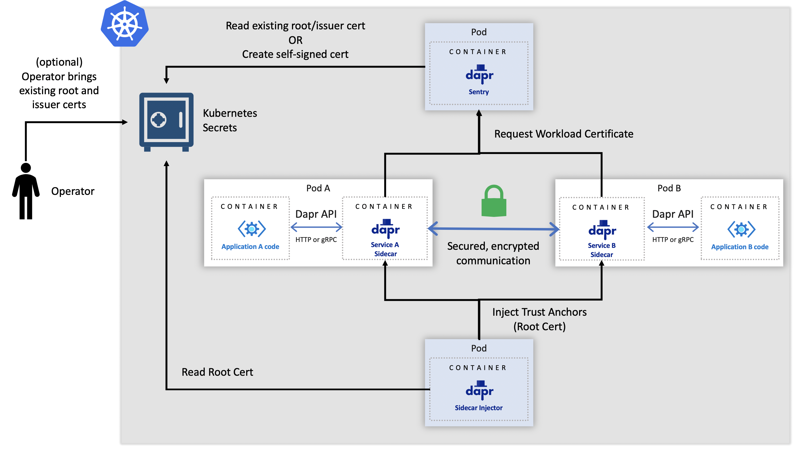
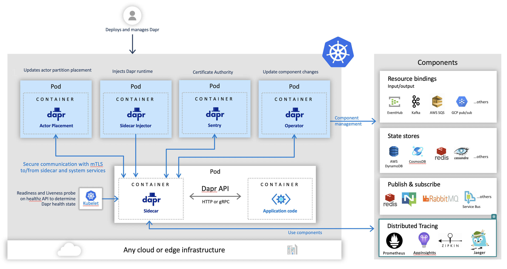

# Security

- [Sidecar-to-App Communication](#sidecar-to-app-communication)
- [Sidecar-to-Sidecar Communication](#sidecar-to-sidecar-communication)
- [Sidecar-to-system-services-communication](#Sidecar-to-system-services-communication)
- [Component namespace scopes and secrets](#Component-namespace-scopes-and-secrets)
- [Network Security](#network-security)
- [Bindings Security](#bindings-security)
- [State Store Security](#state-store-security)
- [Management Security](#management-security)

## Sidecar-to-App communication

The Dapr sidecar runs close to the application through **localhost**. Dapr assumes it runs in the same security domain of the application. As a result, there are no authentication, authorization or encryption between a Dapr sidecar and the application.

## Sidecar-to-Sidecar communication

Dapr includes an "on by default", automatic mutual TLS that provides in-transit encryption for traffic between Dapr sidecars.
To achieve this, Dapr leverages a system service named `Sentry` which acts as a Certificate Authority (CA) and signs workload (app) certificate requests originating from the Dapr sidecar.

Dapr also manages workload certificate rotation, and does so with zero downtime to the application.

Sentry, the CA service, automatically creates and persists self signed root certificates valid for one year, unless existing root certs have been provided by the user.

When root certs are replaced (secret in Kubernetes mode and filesystem for self hosted mode), the Sentry picks them up and re-builds the trust chain without needing to restart, with zero downtime to Sentry.

When a new Dapr sidecar initializes, it first checks if mTLS is enabled. If it is, an ECDSA private key and certificate signing request are generated and sent to Sentry via a gRPC interface. The communication between the Dapr sidecar and Sentry is authenticated using the trust chain cert, which is injected into each Dapr instance by the Dapr Sidecar Injector system service.

In a Kubernetes cluster, the secret that holds the root certificates is scoped to the namespace in which the Dapr components are deployed to and is only accessible by the Dapr system pods.

Dapr also supports strong identities when deployed on Kubernetes, relying on a pod's Service Account token which is sent as part of the certificate signing request (CSR) to Sentry.

By default, a workload cert is valid for 24 hours and the clock skew is set to 15 minutes.

Mutual TLS can be turned off/on by editing the default configuration that is deployed with Dapr via the `spec.mtls.enabled` field.
This can be done for both Kubernetes and self hosted modes. Details for how to do this can be found [here](../../howto/configure-mtls).

### mTLS self hosted
The diagram below shows how the Sentry system service issues certificates for applications based on the root/issuer certificate that is provided by an operator or generated by the Sentry service as stored in a file

### mTLS in Kubernetes
The diagram below shows how the Sentry system service issues certificates for applications based on the root/issuer certificate that is provided by an operator or generated by the Sentry service as stored as a Kubernetes secret

## Sidecar to system services communication

In addition to automatic mTLS between Dapr sidecars, Dapr offers mandatory mTLS between the Dapr sidecar and the Dapr system services, namely the Sentry service (Certificate Authority), Placement service (actor placement) and the Kubernetes Operator.

When mTLS is enabled, Sentry writes the root and issuer certificates to a Kubernetes secret that is scoped to the namespace where the control plane is installed. In self hosted mode, Sentry writes the certificates to a configurable filesystem path.

In Kubernetes, when the Dapr system services start, they automatically mount the secret containing the root and issuer certs and use those to secure the gRPC server that is used by the Dapr sidecar.  

In self hosted mode, each system service can be mounted to a filesystem path to get the credentials.

When the Dapr sidecars initialize, they authenticate with the system services using the workload cert that was issued to them by Sentry, the Certificate Authority.

### mTLS to system services in Kubernetes
The diagram below shows secure communication between the Dapr sidecar and the Dapr Sentry (Certificate Authority), Placement (actor placement) and the Kubernetes Operator system services

## Component namespace scopes and secrets

Dapr components are namespaced. That means a Dapr runtime sidecar instance can only access the components that have been deployed to the same namespace. See the [components scope topic](../../howto/components-scopes) for more details.

Dapr components uses Dapr's built-in secret management capability to manage secrets. See the [secret topic](../secrets/README.md) for more details.

In addition, Dapr offers application-level scoping for components by allowing users to specify which applications can consume given components.For more information about application level scoping, see [here](../../howto/components-scopes#application-access-to-components-with-scopes)

## Network security

You can adopt common network security technologies such as network security groups (NSGs), demilitarized zones (DMZs) and firewalls to provide layers of protections over your networked resources.

For example, unless configured to talk to an external binding target, Dapr sidecars don’t open connections to the internet. And most binding implementations use outbound connections only. You can design your firewall rules to allow outbound connections only through designated ports.

## Bindings security

Authentication with a binding target is configured by the binding’s configuration file. Generally, you should configure the minimum required access rights. For example, if you only read from a binding target, you should configure the binding to use an account with read-only access rights.

## State store security

Dapr doesn't transform the state data from applications. This means Dapr doesn't attempt to encrypt/decrypt state data. However, your application can adopt encryption/decryption methods of your choice, and the state data remains opaque to Dapr.

Dapr does not store any data at rest.

Dapr uses the configured authentication method to authenticate with the underlying state store. And many state store implementations use official client libraries that generally use secured communication channels with the servers.

## Management security

When deploying on Kubernetes, you can use regular [Kubernetes RBAC]( https://kubernetes.io/docs/reference/access-authn-authz/rbac/) to control access to management activities.

When deploying on Azure Kubernetes Service (AKS), you can use [Azure Active Directory (AD) service principals]( https://docs.microsoft.com/en-us/azure/active-directory/develop/app-objects-and-service-principals) to control access to management activities and resource management.