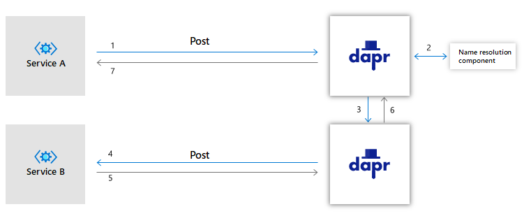

# Service Invocation

Dapr-enabled apps can communicate with each other through well-known endpoints in the form of http or gRPC messages.

1. Service A makes a http/gRPC call meant for Service B.  The call goes to the local Dapr sidecar.  
2. Dapr discovers Service B's location and forwards the message to Service B's Dapr sidecar
3. Service B's Dapr sidecar forwards the request to Service B.  Service B performs its corresponding business logic.
4. Service B sends a response for Service A.  The response goes to Service B's sidecar.
5. Dapr forwards the response to Service A's Dapr sidecar.
6. Service A receives the response.

As an example for all the above, suppose we have the collection of apps described in the following sample, where a python app invokes a Node.js app: https://github.com/dapr/samples/blob/master/2.hello-kubernetes/README.md

In such a scenario, the python app would be "Service A" above, and the Node.js app would be "Service B".

The following describes items 1-6 again in the context of this sample:

1. Suppose the Node.js app has a Dapr app id of "nodeapp", as in the sample.  The python app invokes the Node.js app's `neworder` method by posting `http://localhost:3500/v1.0/invoke/nodeapp/method/neworder`, which first goes to the python app's local Dapr sidecar.
2. Dapr discovers the Node.js app's location and forwards it to the Node.js app's sidecar.
3. The Node.js app's sidecar forwards the request to the Node.js app.  The Node.js app performs its business logic, which, as described in the sample, is to log the incoming message and then persist the order ID into Redis (not shown in the diagram above).

Steps 4-5 are the same as the list above.

For more information, see:

- The [Service Invocation API Spec](../../reference/api/service_invocation_api.md)
- A [HowTo](../../howto/invoke-and-discover-services/README.md) on Service Invocation
