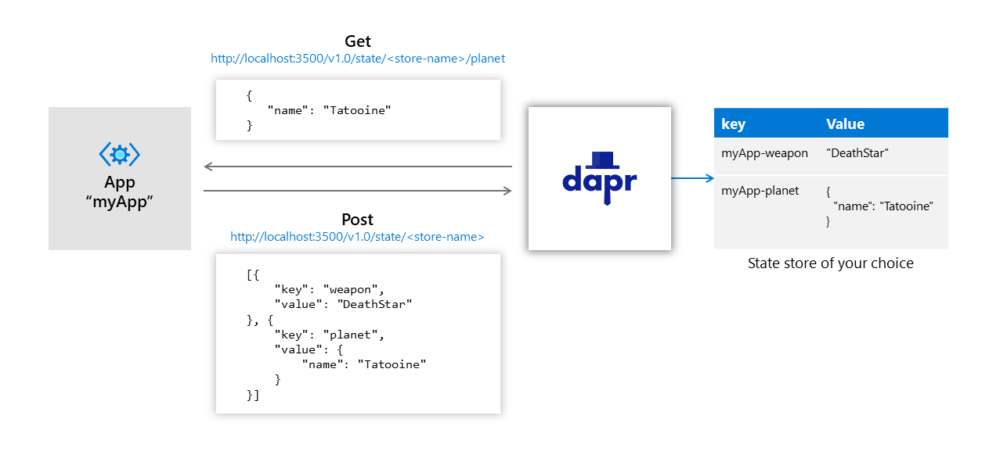

# State management

Dapr makes it simple for you to store key/value data in a store of your choice.



## Contents:

- [State Management API](#state-management-api)
- [State Store Behaviors](#state-store-behaviors)
- [Concurrency](#concurrency)
- [Consistency](#consistency)
- [Retry Policies](#retry-policies)
- [Bulk Operations](#bulk-operations)
- [Querying State Store Directly](#querying-state-store-directly)
- [References](#references)

## State management API

Dapr provides reliable state management to applications through a state management buidling block API. Developers can use this API to retrieve, save and delete state values by providing keys.  

Dapr data stores are components. Dapr ships with [Redis](https://redis.io
) out-of-box for local development in self hosted mode. Dapr allows you to plug in other data stores as components such as [Azure CosmosDB](https://azure.microsoft.com/services/cosmos-db/), [SQL Server](https://azure.microsoft.com/services/sql-database/), [AWS DynamoDB](https://aws.amazon.com/DynamoDB
), [GCP Cloud Spanner](https://cloud.google.com/spanner
) and [Cassandra](http://cassandra.apache.org/).

Visit [State API](../../reference/api/state_api.md) for more information.

> **NOTE:** Dapr prefixes state keys with the ID of the current Dapr instance. This allows multiple Dapr instances to share the same state store.

## State store behaviors

Dapr allows developers to attach to a state operation request additional metadata that describes how the request is expected to be handled. For example, you can attach concurrency requirements, consistency requirements, and retry policy to any state operation requests.

By default, your application should assume a data store is **eventually consistent** and uses a **last-write-wins** concurrency pattern. On the other hand, if you do attach metadata to your requests, Dapr passes the metadata along with the requests to the state store and expects the data store to fulfil the requests.

Not all stores are created equal. To ensure portability of your application, you can query the capabilities of the store and make your code adaptive to different store capabilities.

The following table summarizes the capabilities of existing data store implementations.

Store | Strong consistent write | Strong consistent read | ETag|
----|----|----|----
Cosmos DB | Yes | Yes | Yes
Redis | Yes | Yes | Yes
Redis (clustered)| Yes | No | Yes
SQL Server | Yes | Yes | Yes

## Concurrency

Dapr supports optimistic concurrency control (OCC) using ETags. When a state is requested, Dapr always attaches an **ETag** property to the returned state. And when the user code tries to update or delete a state, it's expected to attach the ETag through the **If-Match** header. The write operation can succeed only when the provided ETag matches with the ETag in the database.

Dapr chooses OCC because in many applications, data update conflicts are rare because clients are naturally partitioned by business contexts to operate on different data. However, if your application chooses to use ETags, a request may get rejected because of mismatched ETags. It's recommended that you use a [Retry Policy](#Retry-Policies) to compensate for such conflicts when using ETags.

If your application omits ETags in writing requests, Dapr skips ETag checks while handling the requests. This essentially enables the **last-write-wins** pattern, compared to the **first-write-wins** pattern with ETags.

> **NOTE:** For stores that don't natively support ETags, it's expected that the corresponding Dapr state store implementation simulates ETags and follows the Dapr state management API specification when handling states. Because Dapr state store implementations are technically clients to the underlying data store, such simulation should be straightforward using the concurrency control mechanisms provided by the store.

## Consistency

Dapr supports both **strong consistency** and **eventual consistency**, with eventual consistency as the default behavior.

When strong consistency is used, Dapr waits for all replicas (or designated quorums) to acknowledge before it acknowledges a write request. When eventual consistency is used, Dapr returns as soon as the write request is accepted by the underlying data store, even if this is a single replica.

## Retry policies

Dapr allows you to attach a retry policy to any write request. A policy is described by an **retryInterval**, a **retryPattern** and a **retryThreshold**. Dapr keeps retrying the request at the given interval up to the specified threshold. You can choose between a **linear** retry pattern or an **exponential** (backoff) pattern. When the **exponential** pattern is used, the retry interval is doubled after each attempt.

## Bulk operations

Dapr supports two types of bulk operations - **bulk** or **multi**. You can group several requests of the same type into a bulk (or a batch). Dapr submits requests in the bulk as individual requests to the underlying data store. In other words, bulk operations are not transactional. On the other hand, you can group requests of different types into a multi-operation, which is handled as an atomic transaction.

## Querying state store directly

Dapr saves and retrieves state values without any transformation. You can query and aggregate state directly from the underlying state store. For example, to get all state keys associated with an application ID "myApp" in Redis, use:

```bash
KEYS "myApp*"
```

> **NOTE:** See [How to query Redis store](../../howto/query-state-store/query-redis-store.md) for details on how to query a Redis store.
>

### Querying actor state

If the data store supports SQL queries, you can query an actor's state using SQL queries. For example use:

```sql
SELECT * FROM StateTable WHERE Id='<app-id>||<actor-type>||<actor-id>||<key>'
```

You can also perform aggregate queries across actor instances, avoiding the common turn-based concurrency limitations of actor frameworks. For example, to calculate the average temperature of all thermometer actors, use:

```sql
SELECT AVG(value) FROM StateTable WHERE Id LIKE '<app-id>||<thermometer>||*||temperature'
```

> **NOTE:** Direct queries of the state store are not governed by Dapr concurrency control, since you are not calling through the Dapr runtime. What you see are snapshots of committed data which are acceptable for read-only queries across multiple actors, however writes should be done via the actor instances.

## References

* [Spec: Dapr state management specification](../../reference/api/state_api.md)
* [Spec: Dapr actors specification](../../reference/api/actors_api.md)
* [How-to: Set up Azure Cosmos DB store](../../howto/setup-state-store/setup-azure-cosmosdb.md)
* [How-to: Query Azure Cosmos DB store](../../howto/query-state-store/query-cosmosdb-store.md)
* [How-to: Set up Redis store](../../howto/setup-state-store/setup-redis.md)
* [How-to: Query Redis store](../../howto/query-state-store/query-redis-store.md)
* [How-to: Set up SQL Server store](../../howto/setup-state-store/setup-sqlserver.md)
* [How-to: Query SQL Server store](../../howto/query-state-store/query-sqlserver-store.md)
