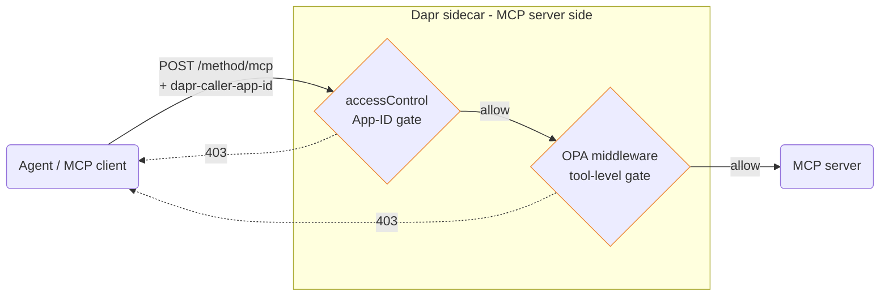

How to define per-agent access control policies for MCP servers in Dapr.

For the full `accessControl` schema and HTTP-verb-level controls, see [Service invocation access control]({}). This page applies that mechanism specifically to MCP traffic, with the patterns and trade-offs that matter for agents.

## Overview

In a multi-agent system, different agents should have different levels of access to MCP servers. An analysis agent might be allowed to read data from one server but not reach a server that performs writes. An operations agent might call write servers but not destructive ones. Without explicit policies, any agent in your namespace could call any MCP server — a serious attack surface.

Dapr lets you enforce this using **access control lists (ACLs)**, defined as part of a Dapr `Configuration` resource. ACLs identify callers by their Dapr App ID (which is cryptographically authenticated by [SPIFFE mTLS]({})) and allow or deny calls. The policy supports a `deny` default, so every access must be explicitly granted.

### Two layers: App-ID gating and per-tool authorization

Dapr access control evaluates **caller App ID → target App ID** at the service-invocation boundary. It is the same mechanism Dapr uses for any other service-to-service traffic, and it gives you coarse-grained gating: which agents may reach which MCP servers at all.

MCP transports — `streamable-http` and `sse` — route all tool calls through a **single HTTP endpoint**. The tool name lives inside the [JSON-RPC](https://www.jsonrpc.org/specification) body (`params.name`), not in the URL path, so HTTP-path-based ACL rules don't give you per-tool granularity on their own. For finer-grained authorization, layer an [OPA middleware](#per-tool-authorization-with-opa) on the MCP server's inbound pipeline — it reads the JSON-RPC body, extracts the tool name, and applies a Rego policy keyed by `(caller App ID, tool name)`.

You can also split tools across separate MCP servers (one App ID per group) and let the App-ID policy do the work — see [Per-tool granularity through separate MCP servers](#per-tool-granularity-through-separate-mcp-servers). For workflow-centric, argument-level RBAC inside a single server, see the [`MCPServer` resource]({}) middleware hooks.

## How it works

When an MCP client invokes a tool, the request travels through Dapr's service-invocation layer to the MCP server. The ACL policy is evaluated **before** the request reaches the application. If the calling App ID is not permitted, Dapr returns a `403 Forbidden` and the call never executes.

The access control policy is attached to the MCP server's App ID via a `Configuration` resource applied to the sidecar through `--config`.

## Defining a policy

The simplest pattern uses `Configuration` `accessControl` with a default action and per-caller overrides:

```yaml
apiVersion: dapr.io/v1alpha1
kind: Configuration
metadata:
  name: mcp-server-policy
spec:
  accessControl:
    defaultAction: deny        # callers not listed below are denied
    trustDomain: "public"
    policies:
    - appId: analyst-agent
      defaultAction: allow     # this caller is explicitly allowed
      namespace: "default"
```

Apply the `Configuration` and attach it to the MCP server's App ID when starting Dapr:

```bash
dapr run \
  --app-id mcp-server \
  --app-port 8000 \
  --resources-path ./components \
  --config ./config/mcp-server-policy.yaml \
  -- python server.py
```

On Kubernetes, set the configuration on the pod by annotating it with `dapr.io/config: mcp-server-policy`.

| Field | Description |
|---|---|
| `defaultAction` (top-level) | Default for any App ID not listed in `policies`. Set to `deny` for a zero-trust posture. |
| `trustDomain` | Trust domain in which the policy applies. `"public"` covers traffic within a single Dapr namespace. |
| `policies[].appId` | The Dapr App ID of the calling agent. |
| `policies[].defaultAction` | `allow` or `deny` for this caller. |
| `policies[].namespace` | The Dapr namespace the caller runs in (typically `"default"`). |

ACL changes take effect after the target Dapr sidecar reloads the configuration — restart the sidecar to apply.

## Deny-all baseline

Start from a deny-all posture and grant access incrementally:

```yaml
# config/deny-all.yaml
apiVersion: dapr.io/v1alpha1
kind: Configuration
metadata:
  name: mcp-policy
spec:
  accessControl:
    defaultAction: deny
    trustDomain: "public"
```

Attach it to the MCP server's sidecar and verify that no caller can reach it. Then layer in allow rules by extending the same `Configuration` and re-applying it.

## Allowing specific callers

To allow a specific agent App ID while keeping everything else denied:

```yaml
spec:
  accessControl:
    defaultAction: deny
    trustDomain: "public"
    policies:
    - appId: analyst-agent
      defaultAction: allow
      namespace: "default"
```

`analyst-agent` can invoke this MCP server; all other callers are denied at the service-invocation boundary.

## Per-tool authorization with OPA

App-ID gating is coarse — it controls whether an agent may reach an MCP server at all, but every tool on that server is equally reachable. For finer-grained `(caller App ID, tool name)` authorization, layer an [Open Policy Agent (OPA) middleware]({}) onto the MCP server's inbound HTTP pipeline. The OPA middleware reads the JSON-RPC request body, your Rego policy extracts `method` and `params.name`, and the decision is keyed by the caller's App ID (propagated by Dapr as the `dapr-caller-app-id` header).

### How OPA gates per-tool MCP traffic



The two layers compose:

1. `accessControl` rejects unauthenticated or disallowed App IDs **before** any middleware runs.
2. OPA inspects the JSON-RPC body of the allowed request and applies tool-level rules.

### Enable the OPA middleware

OPA's HTTP middleware ships with Dapr. To inspect the JSON-RPC body, set `readBody: "true"` and pass the caller App ID through `includedHeaders`:

```yaml
apiVersion: dapr.io/v1alpha1
kind: Component
metadata:
  name: mcp-tool-authz
spec:
  type: middleware.http.opa
  version: v1
  metadata:
    - name: includedHeaders
      value: "dapr-caller-app-id"
    - name: readBody
      value: "true"
    - name: defaultStatus
      value: "403"
    - name: rego
      value: |
        package http

        default allow = false

        # Per-tool authorization for MCP JSON-RPC traffic.
        #
        # `input.request.body` is the raw JSON-RPC payload, e.g.
        #   {"jsonrpc":"2.0","id":1,"method":"tools/call",
        #    "params":{"name":"get_inventory","arguments":{...}}}
        #
        # `input.request.headers["dapr-caller-app-id"]` is the verified caller App ID.
        body := json.unmarshal(input.request.body)
        caller := input.request.headers["dapr-caller-app-id"]

        # Allow MCP handshake / discovery for any allowed caller.
        allow {
          body.method == "initialize"
        }
        allow {
          body.method == "tools/list"
        }

        # Per-tool RBAC on tools/call.
        allow {
          body.method == "tools/call"
          allowed_tools[caller][_] == body.params.name
        }

        # (caller App ID → permitted tool names) policy.
        allowed_tools := {
          "analyst-agent": ["get_inventory", "get_schema"],
          "ops-agent":     ["get_inventory", "get_schema", "update_stock"],
          "admin-agent":   ["get_inventory", "get_schema", "update_stock", "drop_table"],
        }
```

Attach the middleware to the MCP server's app HTTP pipeline:

```yaml
apiVersion: dapr.io/v1alpha1
kind: Configuration
metadata:
  name: mcp-server-policy
spec:
  appHttpPipeline:
    handlers:
      - name: mcp-tool-authz
        type: middleware.http.opa
```

Restart the MCP server's sidecar with the updated `Configuration`. Requests for tools not on the caller's allow-list now return `403` before the JSON-RPC body reaches the MCP server.

### Notes and trade-offs

- **Body shape matters.** The Rego policy assumes standard JSON-RPC over `streamable-http`. Validate the shape your MCP server expects (especially batched requests, which arrive as a JSON array) and adapt the policy.
- **`readBody: "true"` buffers each request fully in memory.** For very large tool argument payloads, factor this into capacity planning.
- **Defense in depth, not a replacement.** Keep the App-ID `accessControl` policy in place — OPA's job is the *tool-level* refinement, not the *server-level* perimeter.
- **Workflow-centric alternative.** If you want argument-level RBAC, audit, redaction, or response filtering inside one MCP server *and* you're willing to invoke tools through the [Dapr Workflow]({}) client, use the [`MCPServer` resource]({}) middleware hooks instead.

## Per-tool granularity through separate MCP servers

When you need per-tool authorization at the service-invocation layer, split the tools across separate MCP servers (one per group) and gate each one with its own `Configuration`:

```
analyst-agent  ──► mcp-db-schema   (schema introspection only)
analyst-agent  ──► mcp-db-query    (read queries only)
ops-agent      ──► mcp-db-schema
ops-agent      ──► mcp-db-query
ops-agent      ──► mcp-db-write    (write operations)
admin-agent    ──► mcp-db-schema
admin-agent    ──► mcp-db-query
admin-agent    ──► mcp-db-write
admin-agent    ──► mcp-db-ddl      (destructive DDL operations)
```

Each MCP server has its own App ID and its own `Configuration` with a deny-by-default policy listing the App IDs allowed to call it. The policy boundary matches the trust boundary, and an agent cannot reach a server its App ID isn't allow-listed for.

If splitting servers is not an option, use [OPA](#per-tool-authorization-with-opa) on the MCP server's inbound pipeline for `(caller, tool)` decisions, or the [`MCPServer` resource]({}) `beforeCallTool` hook for argument-level RBAC inside a single server.

## Combining ACLs with OAuth 2.0 bearer middleware

ACL policies and OAuth 2.0 bearer middleware are independent enforcement layers — apply both to the MCP server for defense in depth:

1. **ACL** — controls which agent App IDs are allowed to call which MCP servers (enforced by Dapr's service-invocation layer using SPIFFE identity).
2. **Bearer middleware** — validates that the caller presents a live, signed JWT from a trusted identity provider (enforced at the HTTP pipeline level, independent of App ID).

An attacker would need to defeat both layers: forge or steal a valid App ID *and* obtain a valid signed token. See [Authenticating an MCP server]({}) for bearer middleware setup.

## Troubleshooting

**My agent gets `403` even though I added a policy for its App ID.**
Verify the App ID in the policy exactly matches the `--app-id` the agent was started with (case-sensitive). Make sure the MCP server's sidecar has been restarted to pick up the new configuration. Confirm the `namespace` field matches the namespace the calling Dapr app runs in.

**I want to allow all operations for a specific agent.**
Set `defaultAction: allow` at the `policies[].defaultAction` level for that App ID:

```yaml
policies:
- appId: admin-agent
  defaultAction: allow
  namespace: "default"
```

**I want to test with no access control first.**
Don't attach a `Configuration` resource with `accessControl` to the MCP server. Without one, Dapr allows calls from any App ID in the trust domain.

## See also

- [Authenticating an MCP server]({}) — OAuth 2.0 and bearer middleware setup for MCP.
- [MCP security posture]({}) — threat model and defense-in-depth narrative.
- [Service invocation access control]({}) — full `accessControl` policy schema reference.
- [OPA middleware]({}) — reference for the `middleware.http.opa` component used above.
- [`MCPServer` resource]({}) — workflow-hook layer for argument-level RBAC inside a single MCP server.
