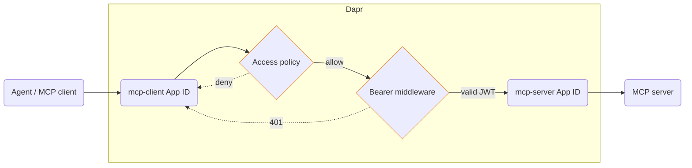

Dapr lets you run [Model Context Protocol (MCP)](https://modelcontextprotocol.io/) clients and servers as Dapr apps and govern the traffic between them with the same controls you already use for any other service-to-service call: App ID identity, access policies, bearer middleware, mTLS, observability, and resiliency.

Because [service invocation]({}) speaks plain HTTP, the agent's existing MCP client can target the local Dapr sidecar and reach the MCP server by App ID. **Off-the-shelf MCP clients and agent frameworks work unchanged** — there is no Dapr-specific MCP SDK to adopt on this path.

## How it works

Both the agent and the MCP server run as Dapr apps, each with its own App ID. The MCP client directs requests to its local sidecar and sets the `dapr-app-id` header (or uses the full service-invocation URL). Dapr resolves the target by App ID, applies the policies attached to the MCP server's App ID, and forwards the request.



For each call, Dapr can:

- Route the request from the calling app to the target app by App ID.
- Authenticate the caller's workload identity ([mTLS]({}) with SPIFFE-issued credentials).
- Apply [access control policies]({}) defined for the target MCP server's App ID.
- Apply HTTP middleware on the inbound pipeline, such as [OAuth 2.0 bearer validation]({}).
- Capture logs, metrics, and traces for the call.

These features apply to MCP calls just like any other service-to-service call, with no changes to MCP client or server code.

## Quickstart

### Step 1: Run an MCP server as a Dapr app

A minimal MCP server using the Python `mcp` library:

```python
# server.py
from mcp.server.fastmcp import FastMCP

mcp = FastMCP("my-mcp-server")

@mcp.tool()
def get_inventory(product_id: str) -> dict:
    """Look up inventory for a product."""
    return {"product_id": product_id, "stock": 42}

if __name__ == "__main__":
    mcp.run(transport="streamable-http")
```

Run it as a Dapr app:

```bash
dapr run \
  --app-id mcp-server \
  --app-port 8000 \
  -- python server.py
```

### Step 2: Connect the agent (MCP client) through the Dapr sidecar

The agent's MCP client targets its local Dapr sidecar's service-invocation endpoint:

```python
# agent.py
import os
from mcp import ClientSession
from mcp.client.streamable_http import streamablehttp_client

DAPR_HTTP_ENDPOINT = os.getenv("DAPR_HTTP_ENDPOINT", "http://localhost:3500")
MCP_URL = f"{DAPR_HTTP_ENDPOINT}/v1.0/invoke/mcp-server/method/mcp"

async def main():
    async with streamablehttp_client(url=MCP_URL) as (read, write, _):
        async with ClientSession(read, write) as session:
            await session.initialize()
            tools = await session.list_tools()
            print("Available tools:", tools)
```

Run the agent as its own Dapr app:

```bash
dapr run \
  --app-id my-agent \
  -- python agent.py
```

Alternative: set the `dapr-app-id` header on the MCP client transport instead of using the explicit `/v1.0/invoke/...` URL. Both forms work — see the [service invocation overview]({}#how-to-invoke-services).

Because both apps run on the same Dapr control plane, service invocation routes `my-agent`'s requests to `mcp-server` by App ID. No additional networking configuration is required.

## Apply security controls

MCP tool calls flow through Dapr's service invocation layer, so you can layer two independent security mechanisms:

- **OAuth 2.0 authentication** — a [bearer middleware]({}) on the MCP server validates inbound JWTs against the issuer's JWKS, `iss`, and `aud` claims. Requests without a valid token are rejected with `401 Unauthorized` before reaching MCP server code. See [Authenticating an MCP server]({}).
- **Access policies (ACLs)** — a `Configuration` resource attached to the MCP server's App ID defines which agent App IDs may invoke it, with a deny-by-default posture. See [MCP access control]({}).

These mechanisms can be used independently or layered together for defense in depth. mTLS using SPIFFE-issued workload identity is on by default for all Dapr-to-Dapr traffic — see [Dapr mTLS]({}).

For the full threat-model framing and what the platform does versus what stays your responsibility, see [MCP security posture]({}).

## When to use this path vs the `MCPServer` resource

This path is the right fit when:

- You use an off-the-shelf MCP client or agent framework (LangGraph, the official MCP SDK, etc.) and want to keep that integration unchanged.
- App-ID-level access control and HTTP-pipeline middleware are enough — you don't need per-argument RBAC or hooks that observe the tool result body.
- You don't already use Dapr Workflows, or you don't want to introduce them just to call MCP tools.

Use the [`MCPServer` resource]({}) instead when:

- You need argument-level RBAC, audit, redaction, or response filtering on a per-tool basis (the `beforeCallTool` / `afterCallTool` / `beforeListTools` / `afterListTools` hooks).
- You need durable retries that survive a sidecar restart mid-call.
- You want per-tool observability slicing (one workflow name per tool).

The two paths are not exclusive — you can use service invocation for most MCP traffic and switch a specific server to the `MCPServer` resource when its policy needs become argument-aware.

## Related links

- [Authenticating an MCP server]({})
- [MCP access control]({})
- [MCP security posture]({})
- [`MCPServer` resource]({})
- [Service invocation overview]({})
- [Dapr mTLS]({})
