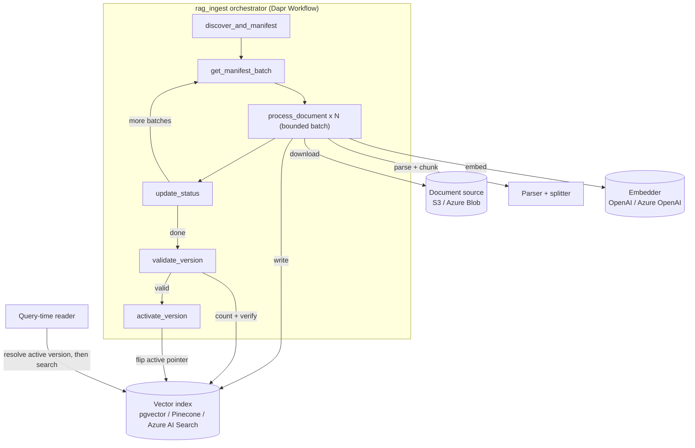

### What is Durable RAG ingestion?

Indexing a document corpus for retrieval-augmented generation (RAG) means downloading, parsing,
chunking, and embedding potentially thousands of documents, then writing the result into a vector
index — a process that can run for hours and is exposed to every failure a long-running job faces:
the embedding provider throttles you, a network call times out, the worker process is OOM-killed
or the pod is rescheduled mid-run.

The Dapr Python SDK's `dapr.ext.rag` extension solves this with `DurableRAGPipeline`: a document
ingestion pipeline built entirely on [Dapr Workflow]({}). Two guarantees
come from that foundation:

- **A crash resumes, it doesn't restart.** Workflow durably checkpoints progress at each activity,
  so a worker crash resumes from the last completed document batch instead of the beginning —
  nothing already embedded is re-processed, and nothing is lost.
- **A query never sees a half-built index.** Every ingestion run builds a separate, inactive index
  *version*. Only once that version validates as complete does it switch to active — so in-flight
  writes are never visible to a query reading the current index.

## How it works



Every step that touches the network or the filesystem — listing a bucket, downloading a document,
calling an embedding API, writing a vector — runs inside a Dapr Workflow activity, never in the
orchestrator itself. That's what makes the whole run replay-safe and resumable after a crash,
exactly like any other Dapr Workflow.

## Supported providers

Any source pairs with any embedder and any vector store:

| Concern | Options |
|---|---|
| Document source | Amazon S3, Azure Blob Storage |
| Parser | Text, Markdown, PDF, HTML, DOCX (via `unstructured`) |
| Embedder | OpenAI, Azure OpenAI |
| Vector store | PostgreSQL + pgvector, Pinecone, Azure AI Search |

Ingestion can also be triggered automatically as documents change — an S3 or Azure Blob event flows
through Dapr pub/sub into a debounced reconciliation run, rather than requiring a manual
re-ingestion call every time a document is added or updated.

## Get started

- **[Quickstart]({})** — run a complete ingest-and-query cycle locally in
  a few minutes, using LocalStack for S3 and a local Postgres for pgvector.
- **[Python SDK docs](/developing-applications/sdks/python/)** — the rest of the Python SDK,
  including [Dapr Workflow]({}), which `dapr.ext.rag` is built on.



## Installation

`dapr.ext.rag` ships inside the main `dapr` package as a set of optional extras — one for the
embedder/core pipeline, and one per source and vector store, so installing it never pulls in a
cloud SDK or database driver you don't need:

```bash
pip install "dapr[rag,rag-s3,rag-pgvector]"
```

Swap in `rag-azure` (Azure Blob), `rag-pinecone` (Pinecone), or `rag-azure-search` (Azure AI
Search) for the combination you need. See the [quickstart]({}) for a
full working example.

## Starting, checking, and querying a pipeline

```python
from dapr.ext.rag import (
    ActiveVersionResolver, DurableRAGPipeline, OpenAIEmbedder, PgVectorStore, S3Source,
    TextSplitter, UnstructuredParser,
)

pipeline = DurableRAGPipeline(
    source=S3Source(bucket="company-docs", prefix="policies/"),
    parser=UnstructuredParser(),
    splitter=TextSplitter(chunk_size=1000, chunk_overlap=150),
    embedder=OpenAIEmbedder(model="text-embedding-3-small"),
    vector_store=PgVectorStore(connection_string="postgresql://...", collection="company_knowledge"),
    state_store_name="rag-pipeline-state",
)
pipeline.run_worker()  # only in the process that should execute the workflow

instance_id = pipeline.start(version="2026-09", activate_when_complete=True)
status = pipeline.get_status("2026-09")

# Query-time (a separate, short-lived process — no source credentials needed):
resolver = ActiveVersionResolver(
    pipeline_id="company_knowledge", state_store_name="rag-pipeline-state",
    vector_store=PgVectorStore(connection_string="postgresql://...", collection="company_knowledge"),
    embedder=OpenAIEmbedder(model="text-embedding-3-small"),
)
matches = resolver.query("What is the remote work policy?", top_k=5)
```

`resolver.query(...)` always resolves the currently-active version fresh before searching it, so a
reader never risks reading from a version that's still being built.

## Event-driven ingestion

Rather than calling `pipeline.start()` by hand, a change notification can trigger ingestion
automatically: an S3 Event Notification or an Azure Event Grid/Service Bus event arrives over Dapr
pub/sub, gets deduplicated by event ID, and — after a short debounce window absorbs a burst of
related changes — starts a single reconciliation run for the affected prefix. Discovery against the
real source remains the source of truth for what actually needs indexing; the event only decides
*when* to check. See the
[example pub/sub triggers](https://github.com/dapr/python-sdk/tree/main/examples/rag) in the Python
SDK repository for a complete, runnable subscriber for each provider.

## Learn more

- [Python SDK RAG examples](https://github.com/dapr/python-sdk/tree/main/examples/rag) — runnable
  samples for every supported source/embedder/vector-store combination, plus a crash/resume demo.
- [`dapr.ext.rag` reference docs](https://github.com/dapr/python-sdk/tree/main/docs/rag) — full
  configuration reference, authentication, version activation, and the Azure-native flagship path
  (Azure Blob → Azure OpenAI → Azure AI Search → grounded answers with citations).
