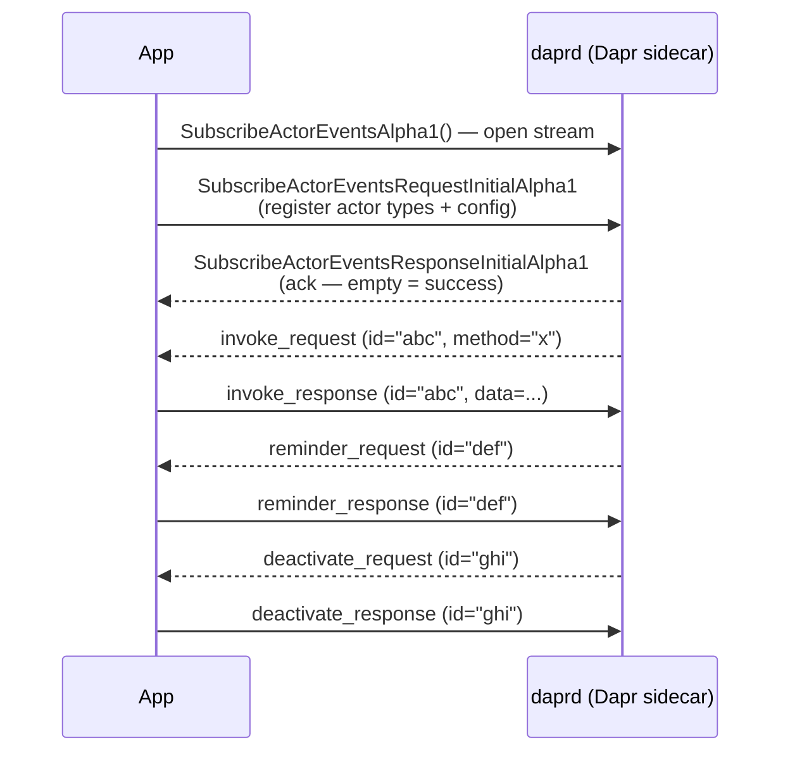

{}
`SubscribeActorEventsAlpha1` is in alpha. The API shape may change in a future release.
{}

This guide shows how to implement `SubscribeActorEventsAlpha1` in Go using the generated gRPC client. Read the [concept doc]({}) first for protocol details and when to prefer this approach over traditional callbacks.

{}
The [Dapr Go SDK](https://github.com/dapr/go-sdk) wraps this protocol in a high-level helper — [`client.SubscribeActorEvents`](https://github.com/dapr/go-sdk/tree/main/examples/actor-grpc) — that manages the stream, callback dispatch, and reconnection for you. This guide documents the raw gRPC protocol directly, which is useful for understanding the wire format or for SDKs that do not yet provide a helper.
{}

## Prerequisites

- [Dapr v1.18 or later]({})
- A state store configured for actors (see [actors overview]({}) for requirements)
- The Dapr proto definitions for your language (Go example uses `github.com/dapr/dapr/pkg/proto/runtime/v1`)

## Protocol summary



Every callback and response is correlated by a unique `id` generated by daprd. The app **must** echo the same `id` on the response.

## Step 1: Open the stream and register actor types

The first message sent on the stream must be an `initial_request` advertising the actor types the app hosts. All fields other than `entities` are optional and override Dapr's defaults.



{}

```go
package main

import (
    "context"
    "log"
    "time"

    "google.golang.org/grpc"
    "google.golang.org/grpc/credentials/insecure"

    runtimev1pb "github.com/dapr/dapr/pkg/proto/runtime/v1"
    anypb "google.golang.org/protobuf/types/known/anypb"
    durationpb "google.golang.org/protobuf/types/known/durationpb"
)

func main() {
    // Connect to the Dapr sidecar gRPC port (default 50001).
    conn, err := grpc.NewClient("localhost:50001",
        grpc.WithTransportCredentials(insecure.NewCredentials()))
    if err != nil {
        log.Fatalf("connect: %v", err)
    }
    defer conn.Close()

    client := runtimev1pb.NewDaprClient(conn)
    ctx := context.Background()

    // Open the bidirectional stream.
    stream, err := client.SubscribeActorEventsAlpha1(ctx)
    if err != nil {
        log.Fatalf("open stream: %v", err)
    }

    // First message: register the actor types this app hosts.
    idleTimeout := durationpb.New(60 * time.Minute)
    err = stream.Send(&runtimev1pb.SubscribeActorEventsRequestAlpha1{
        RequestType: &runtimev1pb.SubscribeActorEventsRequestAlpha1_InitialRequest{
            InitialRequest: &runtimev1pb.SubscribeActorEventsRequestInitialAlpha1{
                Entities:           []string{"MyActor"},
                ActorIdleTimeout:   idleTimeout,
                DrainRebalancedActors: boolPtr(true),
            },
        },
    })
    if err != nil {
        log.Fatalf("send initial: %v", err)
    }

    // Wait for the acknowledgement from daprd.
    msg, err := stream.Recv()
    if err != nil {
        log.Fatalf("recv initial ack: %v", err)
    }
    if msg.GetInitialResponse() == nil {
        log.Fatalf("unexpected first message type")
    }
    log.Println("registered with Dapr, waiting for callbacks")

    // Enter the callback loop.
    handleCallbacks(stream)
}

func boolPtr(b bool) *bool { return &b }
```

{}



## Step 2: Handle callbacks

After the initial handshake, the stream delivers callbacks from daprd. Each callback message uses a `oneof response_type`. The app must send a correlated response for every callback received.



{}

```go
func handleCallbacks(stream runtimev1pb.Dapr_SubscribeActorEventsAlpha1Client) {
    for {
        msg, err := stream.Recv()
        if err != nil {
            log.Printf("stream closed: %v", err)
            return
        }

        switch v := msg.ResponseType.(type) {

        case *runtimev1pb.SubscribeActorEventsResponseAlpha1_InvokeRequest:
            req := v.InvokeRequest
            log.Printf("invoke %s/%s.%s (id=%s)", req.ActorType, req.ActorId, req.Method, req.Id)

            // Execute the actor method and build the response payload.
            result, invokeErr := dispatchMethod(req.ActorType, req.ActorId, req.Method, req.Data)

            resp := &runtimev1pb.SubscribeActorEventsRequestAlpha1{}
            if invokeErr != nil {
                resp.RequestType = &runtimev1pb.SubscribeActorEventsRequestAlpha1_InvokeResponse{
                    InvokeResponse: &runtimev1pb.SubscribeActorEventsRequestInvokeResponseAlpha1{
                        Id:    req.Id,
                        Data:  []byte(invokeErr.Error()),
                        Error: true,
                    },
                }
            } else {
                resp.RequestType = &runtimev1pb.SubscribeActorEventsRequestAlpha1_InvokeResponse{
                    InvokeResponse: &runtimev1pb.SubscribeActorEventsRequestInvokeResponseAlpha1{
                        Id:   req.Id,
                        Data: result,
                    },
                }
            }
            if err := stream.Send(resp); err != nil {
                log.Printf("send invoke response: %v", err)
                return
            }

        case *runtimev1pb.SubscribeActorEventsResponseAlpha1_ReminderRequest:
            req := v.ReminderRequest
            log.Printf("reminder %s/%s name=%s (id=%s)", req.ActorType, req.ActorId, req.Name, req.Id)

            // Return cancel=true to cancel the reminder after this firing.
            shouldCancel := handleReminder(req.ActorType, req.ActorId, req.Name, req.Data)

            if err := stream.Send(&runtimev1pb.SubscribeActorEventsRequestAlpha1{
                RequestType: &runtimev1pb.SubscribeActorEventsRequestAlpha1_ReminderResponse{
                    ReminderResponse: &runtimev1pb.SubscribeActorEventsRequestReminderResponseAlpha1{
                        Id:     req.Id,
                        Cancel: shouldCancel,
                    },
                },
            }); err != nil {
                return
            }

        case *runtimev1pb.SubscribeActorEventsResponseAlpha1_TimerRequest:
            req := v.TimerRequest
            log.Printf("timer %s/%s name=%s (id=%s)", req.ActorType, req.ActorId, req.Name, req.Id)

            shouldCancel := handleTimer(req.ActorType, req.ActorId, req.Name, req.Data)

            if err := stream.Send(&runtimev1pb.SubscribeActorEventsRequestAlpha1{
                RequestType: &runtimev1pb.SubscribeActorEventsRequestAlpha1_TimerResponse{
                    TimerResponse: &runtimev1pb.SubscribeActorEventsRequestReminderResponseAlpha1{
                        Id:     req.Id,
                        Cancel: shouldCancel,
                    },
                },
            }); err != nil {
                return
            }

        case *runtimev1pb.SubscribeActorEventsResponseAlpha1_DeactivateRequest:
            req := v.DeactivateRequest
            log.Printf("deactivate %s/%s (id=%s)", req.ActorType, req.ActorId, req.Id)

            releaseActorState(req.ActorType, req.ActorId)

            if err := stream.Send(&runtimev1pb.SubscribeActorEventsRequestAlpha1{
                RequestType: &runtimev1pb.SubscribeActorEventsRequestAlpha1_DeactivateResponse{
                    DeactivateResponse: &runtimev1pb.SubscribeActorEventsRequestDeactivateResponseAlpha1{
                        Id: req.Id,
                    },
                },
            }); err != nil {
                return
            }
        }
    }
}

// Stubs — replace with your actor logic.
func dispatchMethod(actorType, actorID, method string, data []byte) ([]byte, error) { return nil, nil }
func handleReminder(actorType, actorID, name string, data *anypb.Any) bool         { return false }
func handleTimer(actorType, actorID, name string, data *anypb.Any) bool            { return false }
func releaseActorState(actorType, actorID string)                                   {}
```

{}



## Step 3: Signal an error

If the app cannot process a callback (for example, the actor method is not registered), send a `request_failed` message instead of the typed response. Use gRPC status codes from [google.golang.org/grpc/codes](https://pkg.go.dev/google.golang.org/grpc/codes).

```go
import "google.golang.org/grpc/codes"

stream.Send(&runtimev1pb.SubscribeActorEventsRequestAlpha1{
    RequestType: &runtimev1pb.SubscribeActorEventsRequestAlpha1_RequestFailed{
        RequestFailed: &runtimev1pb.SubscribeActorEventsRequestFailedAlpha1{
            Id:      req.Id,
            Code:    uint32(codes.NotFound),  // marks the failure as permanent/non-retryable
            Message: "actor method not found: " + req.Method,
        },
    },
})
```

{}
daprd treats `codes.NotFound` as a permanent, non-retryable failure. Use other status codes (e.g. `codes.Internal`) for transient errors that Dapr should retry.
{}

## Step 4: Handle reconnection

The stream is a long-lived connection. If daprd restarts or the network is interrupted, `stream.Recv()` returns an error. Reconnect with exponential back-off:

```go
import (
    "math/rand"
    "time"
)

func runWithReconnect(ctx context.Context, client runtimev1pb.DaprClient) {
    backoff := 1 * time.Second
    for {
        if ctx.Err() != nil {
            return
        }
        stream, err := client.SubscribeActorEventsAlpha1(ctx)
        if err != nil {
            log.Printf("open stream error: %v; retrying in %s", err, backoff)
            time.Sleep(backoff + time.Duration(rand.Intn(500))*time.Millisecond)
            backoff = min(backoff*2, 30*time.Second)
            continue
        }
        backoff = 1 * time.Second // reset on success

        if err := sendInitialRequest(stream); err != nil {
            continue
        }
        if _, err := stream.Recv(); err != nil { // wait for initial ack
            continue
        }
        handleCallbacks(stream) // blocks until stream closes
    }
}
```

## Runtime configuration fields

The initial registration message can include the following optional fields to override Dapr's defaults for all actor types on this stream:

| Field | Type | Description |
|-------|------|-------------|
| `entities` | `[]string` | **Required.** Actor types this app hosts. |
| `actor_idle_timeout` | `Duration` | Deactivate an actor after this idle period. Unset = Dapr default (60 minutes). |
| `drain_ongoing_call_timeout` | `Duration` | How long to wait for in-flight calls during rebalancing. Unset = Dapr default (2 seconds). |
| `drain_rebalanced_actors` | `bool` | If true, wait for drain before deactivating rebalanced actors. Unset = Dapr default. |
| `reentrancy` | `ActorReentrancyConfig` | Enable actor reentrancy and set max stack depth. Default: disabled. |
| `entities_config` | `[]ActorEntityConfig` | Per-actor-type overrides for any of the fields above. |

See [actor runtime configuration]({}) for a description of each parameter.

## Coexistence with traditional callbacks

The app-initiated stream and traditional HTTP/gRPC callbacks are not mutually exclusive. Pods that have opened `SubscribeActorEventsAlpha1` receive callbacks via the stream; pods that have not opened the stream continue to use traditional inbound endpoints. Migrate all pods before removing inbound ports and NetworkPolicy rules.

## Related links

- [Actor app-initiated streams concept]({})
- [Actor API reference — SubscribeActorEventsAlpha1]({})
- [Actor runtime configuration]({})
- [Actors overview]({})
