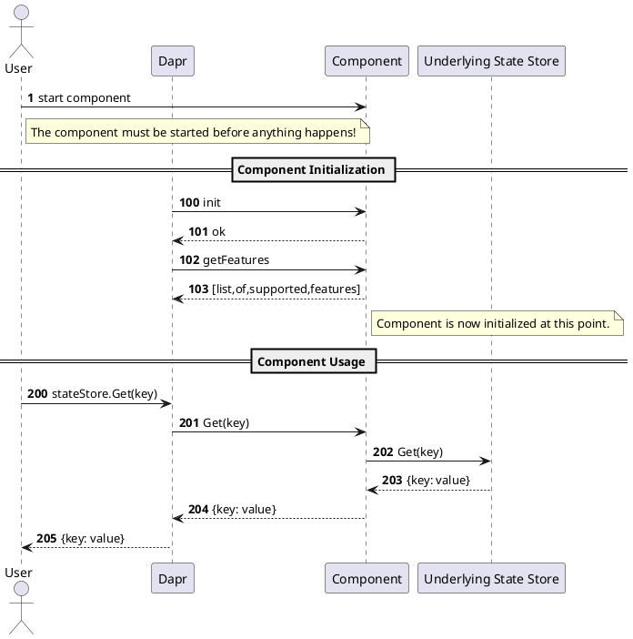

<!-- Doc Title. This doc should be titled something similar to "Developing pluggable components". The .NET docs titled the same will be changed -->

<!-- Another thing about this document: it should be programming language agnostic. This document should describe the step-by-step process of developing a pluggable component but completely bypassing any technology or language specific detail. -->

## Supported component types

Pluggable components is a **preview feature**. Currently, only State Stores (type `state`), PubSub (type `pubsub`) and Bindings (type `bindinds`) are supported. Read more about [preview features
]() 

| Component | Type    | gRPC definition | Built-in Reference Implementation | Docs |
|:---------:|:-------:|:---------------:|:------------------:|------|
|State Store| `state`   |  [state.proto]  | [Redis](https://github.com/dapr/components-contrib/tree/master/state/redis)    | [concept](https://docs.dapr.io/developing-applications/building-blocks/state-management/state-management-overview/), [howto](https://docs.dapr.io/developing-applications/building-blocks/state-management/howto-get-save-state/), [api spec](https://docs.dapr.io/reference/api/state_api/) |
| PubSub    | `pubsub`  |  [pubsub.proto] | [Redis](https://github.com/dapr/components-contrib/tree/master/pubsub/redis)   | [concept](https://docs.dapr.io/developing-applications/building-blocks/pubsub/pubsub-overview/), [howto](https://docs.dapr.io/developing-applications/building-blocks/pubsub/howto-publish-subscribe/), [api spec](https://docs.dapr.io/reference/api/pubsub_api/) |
| Bindings  | `bindings`| [bindings.proto]| [Kafka](https://github.com/dapr/components-contrib/tree/master/bindings/kafka) | [concept](https://docs.dapr.io/developing-applications/building-blocks/bindings/bindings-overview/), [input howto](https://docs.dapr.io/developing-applications/building-blocks/bindings/howto-triggers/), [output howto](https://docs.dapr.io/developing-applications/building-blocks/bindings/howto-bindings/), [api spec](https://docs.dapr.io/reference/api/bindings_api/) | 


## Anatomy of a pluggable component

At high level, a pluggable component is a server that implements and exposes one or more of the gRPC service interfaces defined in the provided [gRPC protobuf files](https://github.com/dapr/dapr/blob/master/dapr/proto/components/v1). 

#### Implementing a gRPC service requires three main steps:
1. **Find the proto definition file.** Proto definitions are provided for each supported service interface (state store, pubsub, bindings).
2. **Create service scaffolding.** Use [protocol buffers and gRPC tools](https://grpc.io) to create the necessary scaffolding for the service. We recomend for the reader to get acquaited with [gRPC concepts by reading its documentation](https://grpc.io/docs/what-is-grpc/core-concepts/).
3. **Define the service**. Provide a concrete implementation of the desired service.


Here's an example of a gRPC service definition file used to create a pluggable component state store ([state.proto]). 

```protobuf=
// StateStore service provides a gRPC interface for state store components.
service StateStore {
  // Initializes the state store component with the given metadata.
  rpc Init(InitRequest) returns (InitResponse) {}

  // Returns a list of implemented state store features.
  rpc Features(FeaturesRequest) returns (FeaturesResponse) {}

  // Deletes the specified key from the state store.
  rpc Delete(DeleteRequest) returns (DeleteResponse) {}

  // Get data from the given key.
  rpc Get(GetRequest) returns (GetResponse) {}

  // Sets the value of the specified key.
  rpc Set(SetRequest) returns (SetResponse) {}

  // Ping the state store. Used for liveness porpuses.
  rpc Ping(PingRequest) returns (PingResponse) {}
  
  // Deletes many keys at once.
  rpc BulkDelete(BulkDeleteRequest) returns (BulkDeleteResponse) {}

  // Retrieves many keys at once.
  rpc BulkGet(BulkGetRequest) returns (BulkGetResponse) {}

  // Set the value of many keys at once.
  rpc BulkSet(BulkSetRequest) returns (BulkSetResponse) {}
}
```

The interface for the `StateStore` service exposes 9 methods:
* 2 methods for initialization and components capability advertisement, 
* 3 methods for CRUD, healthness or liveness check
* 3 methods for bulk operations.
 

As a first step, protocol buffers tools are used to create the server code for this service. After that, the next step is to define concrete implementations for these 9 methods.

Each component has a service definition for its core functionality. For instance, every pluggable State Store **must** provide a implementation for its `StateStore` service interface. In addition to this core functionality, some components  might also expose additional functionality under other **optinal** services. For State Stores, there's also an option to add additional functionality by defining the implementation for a `QueriableStateStore` service and for a `TransactionalStateStore` service.


PubSub components, for instance, only have a single core service interface defined [pubsub.proto]. They have no optional service interface. The same applies for Input Bindings and Output Bindings components: both have a single core service definition on [bindings.proto].


### Leveraging multiple building blocks for a component

In addition to implementing multiple gRPC services from the same component (e.g., `StateStore`, `QueriableStateStore`, `TransactionalStateStore` etc.), a single pluggable component can also expose implementations for other types of components. This means that a single pluggable component can function as a state Store, pubsub, and input or output binding, all at the same time.

Having multiple building blocks behind the same pluggable component is a path to lower the operational burdern of deploying and operationalizing multiple components. On the other hand, it will make implementing and debugging your component harder. If in doubt, we suggest sticking to a separation of concerns strategy and merging multiple components under the same pluggable component only when striclty needed.

⚠️**TODO**: describe how Dapr gets to know about this because we do not really say much about this in the config files, which we only dicuss a few sections on.


### Communication between Dapr and pluggable components

Dapr communicates with pluggable components through Unix domain sockets and shared volumes

### Pluggable component initialization process




## Operationalizing a pluggable component

<!-- Registering and Using a pluggable component with Dapr -->


One aspect in which built-in components and pluggable components diverge is in the operational work required to use each of them.
Aside from providing a [Component specification]({{ ref components-concept.md#component-specification }}}), built-in components do not require any extra steps to be used and Dapr starts them automatically.

In contrast, pluggable components require additional steps before they can communicate with Dapr. The component needs first needs to be started before Dapr and facilitate Dapr-Component communication. This is an important diference to keep in mind, since this will have an impact on how you deploy and run your system.

The following sections provide an overview for the additional steps required for Dapr to communicate with a pluggable component.

### Configuring Dapr


#### Defining a Component CDR for a pluggale component

Spoiler alert: it is not too diferent from a a built-in component. Drop a file in 

#### Preparing your component to be used by Dapr

<!-- Gentlemen, start your components! -->

#### Getting Dapr and your Component to talk

<!-- I know, we will need to rename this section -->

By default Dapr expects to find UDS files for your components in the `/tmp/dapr-components-sockets` folder. This can also be customized to another location by means of the `DAPR_PLUGGABLE_COMPONENTS_SOCKETS_FOLDER` environment variable.

The important thing to keep in mind is that both Dapr and your component need to aggree on the same folder and both should have permissions to access that folder. In particular, both need to have read and write access to the UDS file used by your component.

### Standalone mode

### Packaging your component

Here we alude to the fact that if you package your component as a contaner you can make distribution of your component easier and (and that is the hook for the next section), make it easier to use it with Kubernetes.

### Kubernetes

## Next steps 

This document presented an overview of how of the decisions and process required to create a pluggable componet. It also provided a high level view of the steps required to configure Dapr to use this component and how to make this component and Dapr work together.

* The other "developing pluggable components" doc for .NET
* .NET sample marco will create (put in a placeholder for this)


[state.proto]: https://github.com/dapr/dapr/blob/master/dapr/proto/components/v1/state.proto
[pubsub.proto]: https://github.com/dapr/dapr/blob/master/dapr/proto/components/v1/pubsub.proto
[bindings.proto]: https://github.com/dapr/dapr/blob/master/dapr/proto/components/v1/bindings.proto