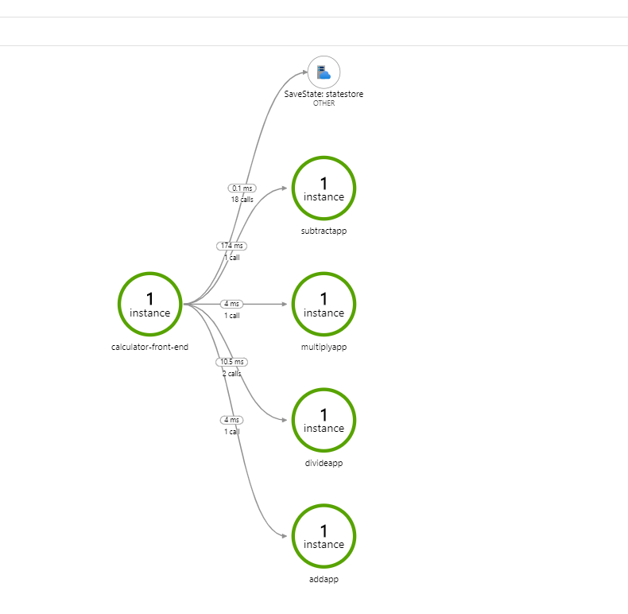

# Set up Application Insights for distributed tracing

Dapr integrates with Application Insights through OpenTelemetry's default exporter along with a dedicated agent known as the [Local Forwarder](https://docs.microsoft.com/en-us/azure/azure-monitor/app/opencensus-local-forwarder).

> Note: The local forwarder is still under preview, but being deprecated. The Application Insights team recommends using [Opentelemetry collector](https://github.com/open-telemetry/opentelemetry-collector) (which is in alpha state) for the future so we're working on moving from local forwarder to [Opentelemetry collector](https://github.com/open-telemetry/opentelemetry-collector).


- [How to configure distributed tracing with Application insights](#How-to-configure-distributed-tracing-with-Application-insights)
- [Tracing configuration](#Tracing-configuration)

## How to configure distributed tracing with Application insights

The following steps show you how to configure Dapr to send distributed tracing data to Application insights.

### Setup Application Insights

1. First, you'll need an Azure account. Please see instructions [here](https://azure.microsoft.com/free/) to apply for a **free** Azure account.
2. Follow instructions [here](https://docs.microsoft.com/en-us/azure/azure-monitor/app/create-new-resource) to create a new Application Insights resource.
3. Get Application insights Intrumentation key from your application insights page
4. On the Application Insights side menu, go to `Configure -> API Access`
5. Click `Create API Key`
6. Select all checkboxes under `Choose what this API key will allow apps to do:`
   - Read telemetry
   - Write annotations
   - Authenticate SDK control channel
7. Generate Key and get API key

### Setup the Local Forwarder

#### Self hosted environment
This is for running the local forwarder on your machine.

1. Run the local fowarder

```bash
docker run -e APPINSIGHTS_INSTRUMENTATIONKEY=<Your Instrumentation Key> -e APPINSIGHTS_LIVEMETRICSSTREAMAUTHENTICATIONAPIKEY=<Your API Key> -d -p 55678:55678 daprio/dapr-localforwarder:0.1-beta1
```

> Note: dapr-localforwarder is created by using [0.1-beta1 release](https://github.com/microsoft/ApplicationInsights-LocalForwarder/releases/tag/v0.1-beta1). If you want to create your own image, use [this dockerfile](./localforwarder/Dockerfile).

1. Create the following YAML files. Copy the native.yaml component file and tracing.yaml configuration file  to the *components/* sub-folder under the same folder where you run your application. 

* native.yaml component

```yaml
apiVersion: dapr.io/v1alpha1
kind: Component
metadata:
  name: native
spec:
  type: exporters.native
  metadata:
  - name: enabled
    value: "true"
  - name: agentEndpoint
    value: "localhost:55678"
```

* tracing.yaml configuration

```yaml
apiVersion: dapr.io/v1alpha1
kind: Configuration
metadata:
  name: tracing
spec:
  tracing:
    enabled: true
    expandParams: true
    includeBody: true
```

3. When running in the local self hosted mode, you need to launch Dapr with the `--config` parameter:

```bash
dapr run --app-id mynode --app-port 3000 --config ./components/tracing.yaml node app.js
```

#### Kubernetes environment

1. Download [dapr-localforwarder.yaml](./localforwarder/dapr-localforwarder.yaml)
2. Replace `<APPINSIGHT INSTRUMENTATIONKEY>` with your Instrumentation Key and `<APPINSIGHT API KEY>` with the generated key in the file

```yaml
          - name: APPINSIGHTS_INSTRUMENTATIONKEY
            value: <APPINSIGHT INSTRUMENTATIONKEY> # Replace with your ikey
          - name: APPINSIGHTS_LIVEMETRICSSTREAMAUTHENTICATIONAPIKEY
            value: <APPINSIGHT API KEY> # Replace with your generated api key
```

3. Deploy dapr-localfowarder.yaml

```bash
kubectl apply -f ./dapr-localforwarder.yaml
```

4. Create the following YAML files

* native.yaml component

```yaml
apiVersion: dapr.io/v1alpha1
kind: Component
metadata:
  name: native
spec:
  type: exporters.native
  metadata:
  - name: enabled
    value: "true"
  - name: agentEndpoint
    value: "<Local forwarder address, e.g. dapr-localforwarder.default.svc.cluster.local:55678>"
```

* tracing.yaml configuration 

```yaml
apiVersion: dapr.io/v1alpha1
kind: Configuration
metadata:
  name: tracing
spec:
  tracing:
    enabled: true
    expandParams: true
    includeBody: true
```

5. Use kubectl to apply the above CRD files:

```bash
kubectl apply -f tracing.yaml
kubectl apply -f native.yaml
```

6. Deploy your app with tracing

When running in Kubernetes mode, apply the configuration by adding a `dapr.io/config` annotation to the container that you want to participate in the distributed tracing, as shown in the following example:

```yaml
apiVersion: apps/v1
kind: Deployment
metadata:
  ...
spec:
  ...
  template:
    metadata:
      ...
      annotations:
        dapr.io/enabled: "true"
        dapr.io/id: "calculator-front-end"
        dapr.io/port: "8080"
        dapr.io/config: "tracing"
```

That's it! There's no need include any SDKs or instrument your application code. Dapr automatically handles the distributed tracing for you.

> **NOTE**: You can register multiple exporters at the same time, and the tracing logs are forwarded to all registered exporters.

Deploy and run some applications. After a few minutes, you should see tracing logs appearing in your Application Insights resource. You can also use **Application Map** to examine the topology of your services, as shown below:



## Tracing configuration

The `tracing` section under the `Configuration` spec contains the following properties:

```yml
tracing:
    enabled: true
    expandParams: true
    includeBody: true
```

The following table lists the different properties.

Property | Type | Description
---- | ------- | -----------
enabled  | bool | Set tracing to be enabled or disabled
expandParams  | bool | When true, expands parameters passed to HTTP endpoints
includeBody  | bool | When true, includes the request body in the tracing event
