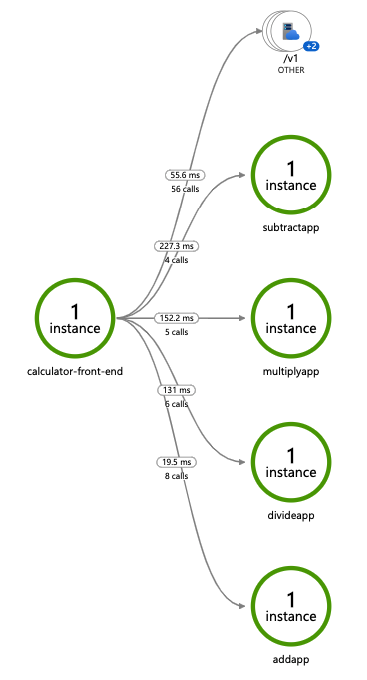

# Using OpenTelemetry Collector to collect traces

Dapr can integrate with [OpenTelemetry
Collector](https://github.com/open-telemetry/opentelemetry-collector)
using the OpenCensus API. This guide walks through an example to use Dapr to push trace events to Azure Application Insights, through the OpenTelemetry Collector.

## Requirements
A installation of Dapr on Kubernetes.

## How to configure distributed tracing with Application Insights

### Setup Application Insights

1. First, you'll need an Azure account. See instructions
   [here](https://azure.microsoft.com/free/) to apply for a **free**
   Azure account.
2. Follow instructions
   [here](https://docs.microsoft.com/en-us/azure/azure-monitor/app/create-new-resource)
   to create a new Application Insights resource.
3. Get the Application Insights Intrumentation key from your Application Insights page.

### Run OpenTelemetry Collector to push to your Application Insights instance

First, save your Application Insights Instrumentation Key in an environment variable
```
export APP_INSIGHTS_KEY=<your-app-insight-key>
```

Next, install the OpenTelemetry Collector to your Kubernetes cluster to push events to your Application Insights instance

1. Check out the file
   [open-telemetry-collector.yaml](open-telemetry-collector/open-telemetry-collector.yaml),
   and replace the `<INSTRUMENTATION-KEY>` placeholder with your
   APP_INSIGHTS_KEY. Or you can run the following

```
# Download the file
wget https://raw.githubusercontent.com/dapr/docs/master/howto/diagnose-with-tracing/open-telemetry-collector/open-telemetry-collector.yaml

# Update the instrumentation key.
sed  -i '' "s/<INSTRUMENTATION-KEY>/$APP_INSIGHTS_KEY/g" open-telemetry-collector.yaml
```

2. Apply the configuration with `kubectl apply -f open-telemetry-collector.yaml`.

Next, set up both a Dapr configuration file to turn on tracing and deploy a tracing exporter component that uses the OpenTelemetry Collector.

1. Create a collector-component.yaml file with this
   [content](open-telemetry-collector/collector-component.yaml)

```
wget https://raw.githubusercontent.com/dapr/docs/master/howto/diagnose-with-tracing/open-telemetry-collector/collector-component.yaml
```

2. Apply the configuration with `kubectl apply -f collector-component.yaml`.

### Deploy your app with tracing

When running in Kubernetes mode, apply the `appconfig` configuration by adding a
`dapr.io/config` annotation to the container that you want to participate in the distributed tracing, as shown in the following
example:

```yaml
apiVersion: apps/v1
kind: Deployment
metadata:
  ...
spec:
  ...
  template:
    metadata:
      ...
      annotations:
        dapr.io/enabled: "true"
        dapr.io/app-id: "MyApp"
        dapr.io/app-port: "8080"
        dapr.io/config: "appconfig"
```

Some of the quickstarts such as  [distributed
calculator](https://github.com/dapr/quickstarts/tree/master/distributed-calculator)
already configure these settings, so if you are using those no additional settings are needed.

That's it! There's no need include any SDKs or instrument your
application code. Dapr automatically handles the distributed tracing
for you.

> **NOTE**: You can register multiple tracing exporters at the same time, and
> the tracing logs are forwarded to all registered exporters.

Deploy and run some applications. After a few minutes, you should see
tracing logs appearing in your Application Insights resource. You can
also use **Application Map** to examine the topology of your services,
as shown below:



> **NOTE**: Only operations going through Dapr API exposed by Dapr
> sidecar (e.g. service invocation or event publishing) are
> displayed in Application Map topology.

## Tracing configuration

The `tracing` section under the `Configuration` spec contains the
following properties:

```yml
tracing:
    samplingRate: "1"
```

The following table lists the different properties.

Property      | Type   | Description
------------- | ------ | -----------
samplingRate  | string | Set sampling rate for tracing to be enabled or disabled.


`samplingRate` is used to enable or disable the tracing. To disable
the sampling rate , set `samplingRate : "0"` in the configuration. The
valid range of samplingRate is between 0 and 1 inclusive. The sampling
rate determines whether a trace span should be sampled or not based on
value. `samplingRate : "1"` will always sample the traces.By default,
the sampling rate is 1 in 10,000
