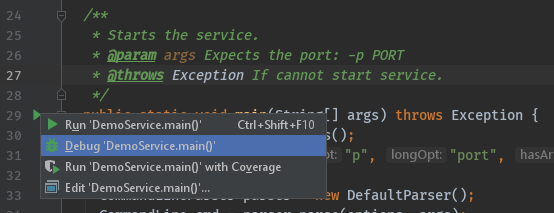

# Configuring IntelliJ Community Edition for debugging with daprd

When developing Dapr applications, you typically use the Dapr CLI to start your 'Daprized' service similar to this:

```bash
dapr run --app-id nodeapp --app-port 3000 --port 3500 app.js
```

This uses the default components yaml files (created on `dapr init`) so that your service can interact with the local Redis container. This is great when you are just getting started but what if you want to attach a debugger to your service and step through the code? This is where you can use the dapr runtime (daprd) to help facilitate this.


One approach to attaching the debugger to your service is to first run `daprd` or `dapr` with the correct arguments from the command line and then launch your code and attach the debugger. While this is a perfectly acceptable solution, it does require a few extra steps and some instruction to developers who might want to clone your repo and hit the "play" button to begin debugging.

This document explains how to use `daprd` directly from IntelliJ. As a pre-requisite, make sure you have initialized the Dapr's dev environment via `dapr init`.

Let's get started!

## Add daprd as an 'External Tool'

First, quit IntelliJ.

Create or edit the file in `$HOME/.IdeaIC2019.3/config/tools/External\ Tools.xml` (change IntelliJ version in path if needed) to add a new `<tool></tool>` entry:

```xml
<toolSet name="External Tools">
  ...
  <!-- 1. Each tool has its own app-id, so create one per application to be debugged -->
  <tool name="daprd for DemoService in examples" description="Dapr sidecar" showInMainMenu="false" showInEditor="false" showInProject="false" showInSearchPopup="false" disabled="false" useConsole="true" showConsoleOnStdOut="true" showConsoleOnStdErr="true" synchronizeAfterRun="true">
    <exec>
      <!-- 2. For Linux or MacOS use: /usr/local/bin/daprd -->
      <option name="COMMAND" value="C:\dapr\daprd.exe" />
      <!-- 3. Choose app, http and grpc ports that do not conflict with other daprd command entries (placement address should not change). -->
      <option name="PARAMETERS" value="-app-id demoservice -app-port 3000 -dapr-http-port 3005 -dapr-grpc-port 52000 -placement-address localhost:50005" />
      <!-- 4. Use the folder where the `components` folder is located -->
      <option name="WORKING_DIRECTORY" value="C:/Code/dapr/java-sdk/examples" />
    </exec>
  </tool>
  ...
</toolSet>
```

## Create or edit run configuration

Now, create or edit the run configuration for the application to be debugged. It can be found in the menu next to the `main()` function.


Now, add the program arguments and environment variables. These need to match the ports defined in the entry in 'External Tool' above.

* Command line arguments for this example: `-p 3000`
* Environment variables for this example: `DAPR_HTTP_PORT=3005;DAPR_GRPC_PORT=5200`


## Start debugging

Once the one-time config above is done, there are two steps required to debug a Java application with Dapr in IntelliJ:

1. Start `daprd` via `Tools` -> `External Tool` in IntelliJ.


2. Start your application in debug mode.



## Wrapping up

After debugging, make sure you stop both `daprd` and your app in IntelliJ.


>Note: Since you didn't launch the service(s) using the **dapr** ***run*** CLI command, but instead by running **daprd**, the **dapr** ***list*** command does not show a list of apps that are currently running.

Happy debugging!
