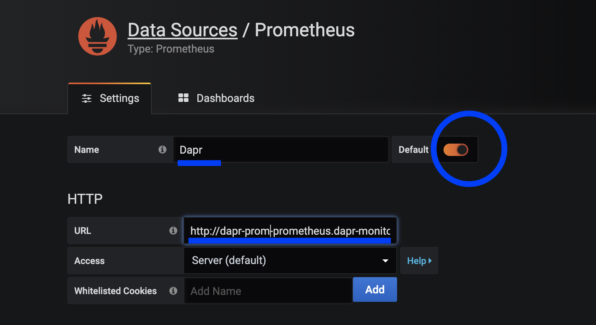
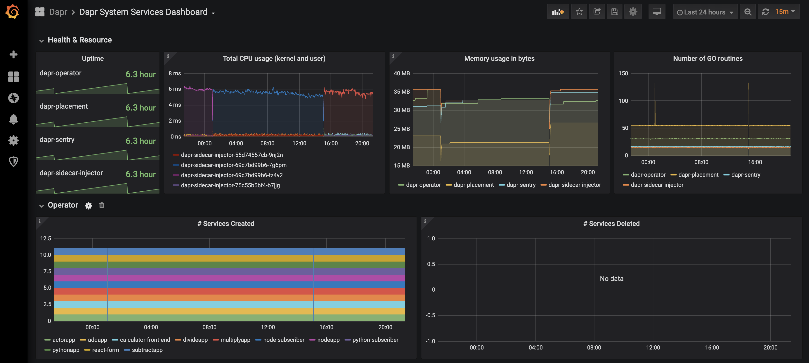

# Observe Metrics with Grafana

This document shows how to view Dapr metrics in Grafana dashboard.

Watch this [video](https://www.youtube.com/watch?v=8W-iBDNvCUM&feature=youtu.be&t=2580) for a demonstration of the Grafana metrics dashboard.

## Prerequisites

- [Set up Prometheus and Grafana](./setup-prometheus-grafana.md)

## Steps to view metrics

- [Configure Prometheus as Data Source](#configure-prometheus-as-data-source)
- [Import Dashboards in Grafana](#import-dashboards-in-grafana)

### Configure Prometheus as Data Source
1. Port-forward to svc/grafana

```
$ kubectl port-forward svc/grafana 8080:80 -n dapr-monitoring
Forwarding from 127.0.0.1:8080 -> 3000
Forwarding from [::1]:8080 -> 3000
Handling connection for 8080
Handling connection for 8080
```

2. Browse `http://localhost:8080`

3. Login with admin and password

4. Click Configuration Settings -> Data Sources

      

5. Add Prometheus as a data soruce.

      

6. Enter Promethesus server address in your cluster.

You can get the prometheus server address by running following command.

```bash
kubectl get svc -n dapr-monitoring
NAME                                 TYPE        CLUSTER-IP     EXTERNAL-IP   PORT(S)             AGE
dapr-prom-kube-state-metrics         ClusterIP   10.0.174.177   <none>        8080/TCP            7d9h
dapr-prom-prometheus-alertmanager    ClusterIP   10.0.255.199   <none>        80/TCP              7d9h
dapr-prom-prometheus-node-exporter   ClusterIP   None           <none>        9100/TCP            7d9h
dapr-prom-prometheus-pushgateway     ClusterIP   10.0.190.59    <none>        9091/TCP            7d9h
dapr-prom-prometheus-server          ClusterIP   10.0.172.191   <none>        80/TCP              7d9h
elasticsearch-master                 ClusterIP   10.0.36.146    <none>        9200/TCP,9300/TCP   7d10h
elasticsearch-master-headless        ClusterIP   None           <none>        9200/TCP,9300/TCP   7d10h
grafana                              ClusterIP   10.0.15.229    <none>        80/TCP              5d5h
kibana-kibana                        ClusterIP   10.0.188.224   <none>        5601/TCP            7d10h

```

In this howto, the server is `dapr-prom-prometheus-server`.

So you need to set up Prometheus data source with the below settings:

- Name: `Dapr`
- HTTP URL: `http://dapr-prom-prometheus-server.dapr-monitoring`
- Default: On



7. Click `Save & Test` button to verify that connected succeeded.

### Import Dashboards in Grafana

In the upper left, click the "+" then "Import". 

You can now import built-in [Grafana dashboard templates](https://github.com/dapr/dapr/tree/master/grafana).

Starting from Dapr 0.10.0, Grafana dashboards are now part of [release assets](https://github.com/dapr/dapr/releases/tag/v0.10.0). 
You can find grafana-actor-dashboard.json, grafana-sidecar-dashboard.json, grafana-system-services-dashboard.json in release assets.


9. Find the dashboard that you imported and enjoy!



You can find more screenshots of Dapr dashboards [here](../../reference/dashboard/img/).

# References

* [Set up Prometheus and Grafana](./setup-prometheus-grafana.md)
* [Prometheus Installation](https://github.com/helm/charts/tree/master/stable/prometheus-operator)
* [Prometheus on Kubernetes](https://github.com/coreos/kube-prometheus)
* [Prometheus Kubernetes Operator](https://github.com/helm/charts/tree/master/stable/prometheus-operator)
* [Prometheus Query Language](https://prometheus.io/docs/prometheus/latest/querying/basics/)
