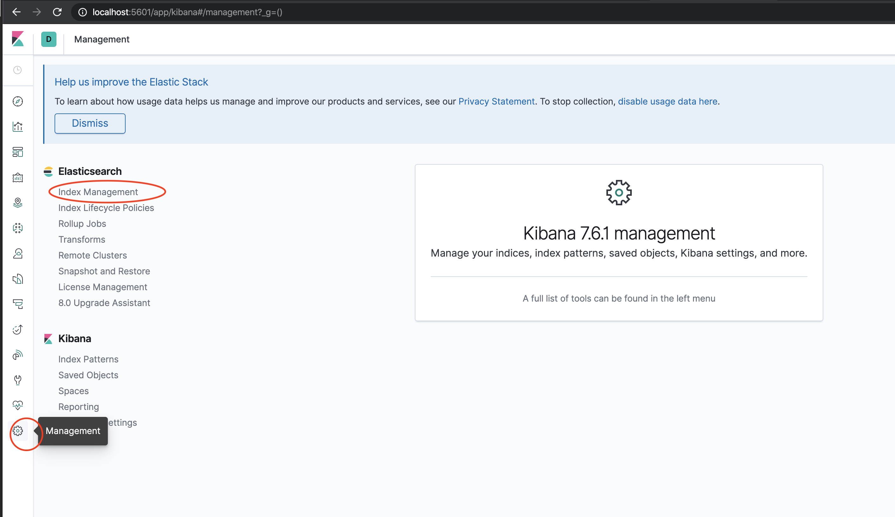
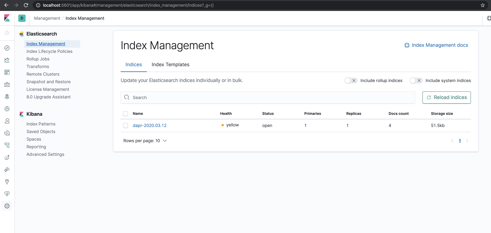
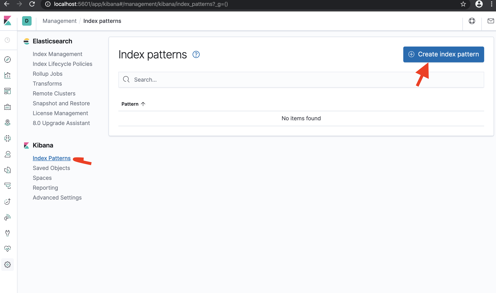
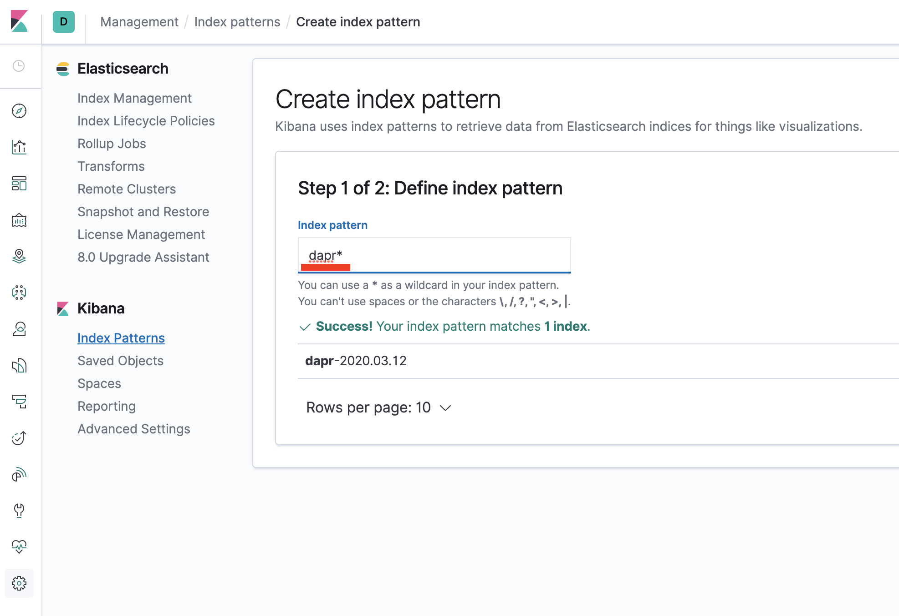
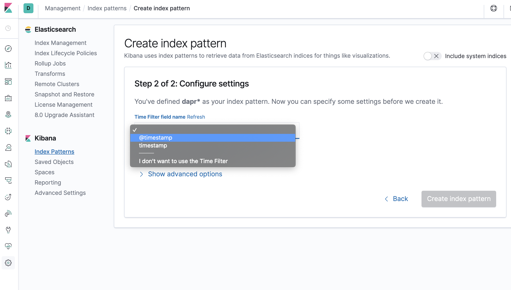
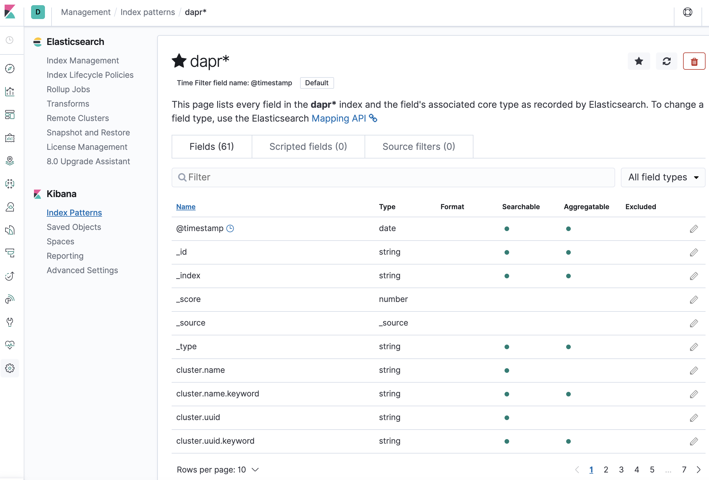
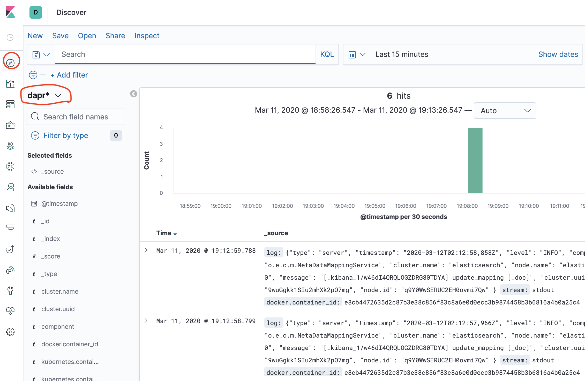

# Set up Fluentd, Elastic search and Kibana in Kubernetes

This document descriebs how to install Fluentd, Elastic Search, and Kibana to search logs in Kubernetes

## Prerequisites

- Kubernetes (> 1.14)
- [kubectl](https://kubernetes.io/docs/tasks/tools/install-kubectl/)
- [Helm 3](https://helm.sh/)

## Contents

  - [Install Fluentd, Elastic Search, and Kibana](#install-fluentd-elastic-search-and-kibana)
  - [Install Fluentd](#install-fluentd)
  - [Install Dapr with JSON formatted logs](#install-dapr-with-json-formatted-logs)
  - [Search logs](#search-logs)

## Install Elastic search and Kibana

1.  Create namespace for monitoring tool and add Helm repo for Elastic Search

```bash
kubectl create namespace dapr-monitoring
```

2. Add Elastic helm repo

```bash
helm repo add elastic https://helm.elastic.co
helm repo update
```

3. Install Elastic Search using Helm

By default the chart creates 3 replicas which must be on different nodes.  If your cluster has less than 3 nodes, specify a lower number of replicas.  For example, this sets it to 1:

```
helm install elasticsearch elastic/elasticsearch -n dapr-monitoring --set replicas=1
```

Otherwise:

```bash
helm install elasticsearch elastic/elasticsearch -n dapr-monitoring
```

If you are using minikube or want to disable persistent volumes for development purposes, you can disable it by using the following command.
```bash
helm install elasticsearch elastic/elasticsearch -n dapr-monitoring --set persistence.enabled=false --replicas=1
```

4. Install Kibana

```bash
helm install kibana elastic/kibana -n dapr-monitoring
```

5. Validation

Ensure Elastic Search and Kibana are running in your Kubernetes cluster.

```bash
kubectl get pods -n dapr-monitoring
NAME                            READY   STATUS    RESTARTS   AGE
elasticsearch-master-0          1/1     Running   0          6m58s
kibana-kibana-95bc54b89-zqdrk   1/1     Running   0          4m21s
```

## Install Fluentd

1. Install config map and Fluentd as a daemonset

Navigate to the following path if you're not already there (the one this document is in):

```
docs/howto/setup-monitoring-tools
```

> Note: If you already have Fluentd running in your cluster, please enable the nested json parser to parse JSON formatted log from Dapr.

```bash
kubectl apply -f ./fluentd-config-map.yaml
kubectl apply -f ./fluentd-dapr-with-rbac.yaml
```

2. Ensure that Fluentd is running as a daemonset; the number of instances should be the same as the number of cluster nodes.  In the example below we only have 1 node.

```bash
kubectl get pods -n kube-system -w
NAME                          READY   STATUS    RESTARTS   AGE
coredns-6955765f44-cxjxk      1/1     Running   0          4m41s
coredns-6955765f44-jlskv      1/1     Running   0          4m41s
etcd-m01                      1/1     Running   0          4m48s
fluentd-sdrld                 1/1     Running   0          14s
```


## Install Dapr with JSON formatted logs

1. Install Dapr with enabling JSON-formatted logs

```bash
helm repo add dapr https://daprio.azurecr.io/helm/v1/repo
helm repo update
helm install dapr dapr/dapr --namespace dapr-system --set global.logAsJson=true
```

2. Enable JSON formatted log in Dapr sidecar

Add `dapr.io/log-as-json: "true"` annotation to your deployment yaml.

Example:
```yaml
apiVersion: apps/v1
kind: Deployment
metadata:
  name: pythonapp
  namespace: default
  labels:
    app: python
spec:
  replicas: 1
  selector:
    matchLabels:
      app: python
  template:
    metadata:
      labels:
        app: python
      annotations:
        dapr.io/enabled: "true"
        dapr.io/id: "pythonapp"
        dapr.io/log-as-json: "true"
...
```

## Search logs

> Note: Elastic Search takes a time to index the logs that Fluentd sends. 

1. Port-forward to svc/kibana-kibana

```
$ kubectl port-forward svc/kibana-kibana 5601 -n dapr-monitoring
Forwarding from 127.0.0.1:5601 -> 5601
Forwarding from [::1]:5601 -> 5601
Handling connection for 5601
Handling connection for 5601
```

2. Browse `http://localhost:5601`

3. Click Management -> Index Management



4. Wait until dapr-* is indexed.



5. Once dapr-* indexed, click Kibana->Index Patterns and Create Index Pattern



6. Define index pattern - type `dapr*` in index pattern



7. Select time stamp filed: `@timestamp`



8. Confirm that `scope`, `type`, `app_id`, `level`, etc are being indexed.

> Note: if you cannot find the indexed field, please wait. it depends on the volume of data and resource size where elastic search is running.



9. Click `discover` icon and search `scope:*`

> Note: it would take some time to make log searchable based on the data volume and resource.



# References

* [Fluentd for Kubernetes](https://docs.fluentd.org/v/0.12/articles/kubernetes-fluentd)
* [Elastic search helm chart](https://github.com/elastic/helm-charts/tree/master/elasticsearch)
* [Kibana helm chart](https://github.com/elastic/helm-charts/tree/master/kibana)
* [Kibana Query Language](https://www.elastic.co/guide/en/kibana/current/kuery-query.html)
