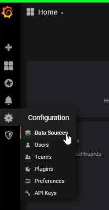
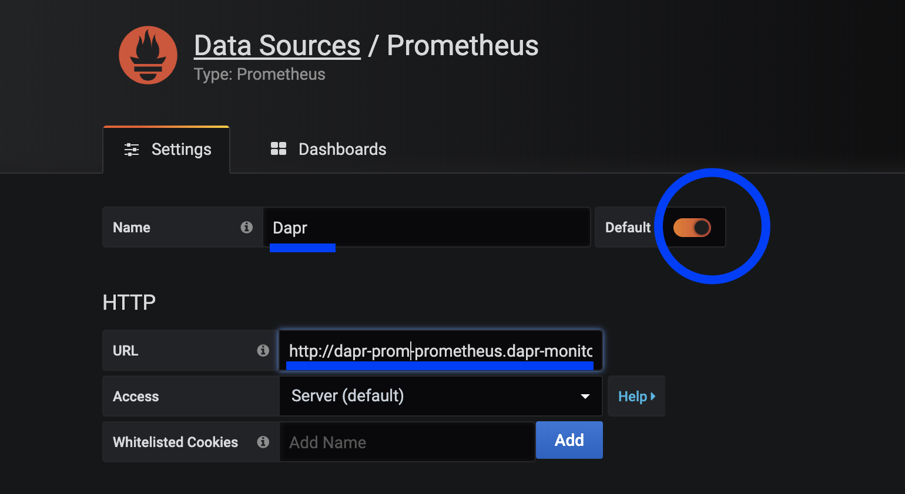
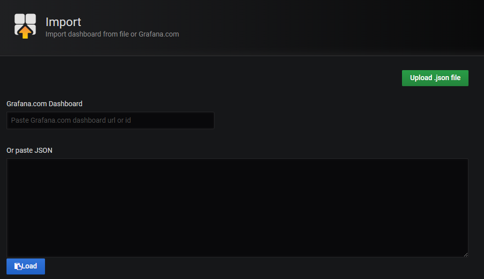
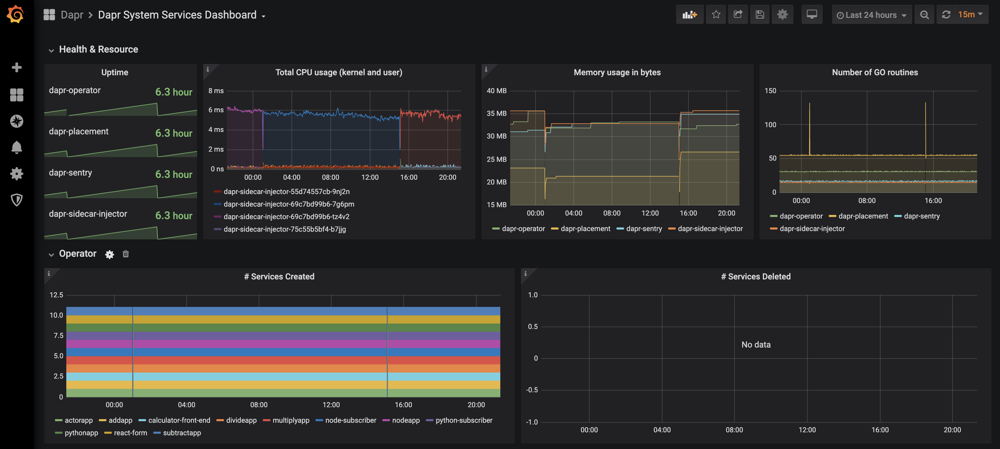

# Set up Prometheus and Grafana

This document shows how to install Prometheus and Grafana to view metrics.

Watch this [video](https://www.youtube.com/watch?v=8W-iBDNvCUM&feature=youtu.be&t=2580) for a demonstration of the Grafana metrics dashboard.

## Prerequisites

- Kubernetes (> 1.14)
- [kubectl](https://kubernetes.io/docs/tasks/tools/install-kubectl/)
- [Helm 3](https://helm.sh/)

## Contents

  - [Install Prometheus and Grafana](#install-prometheus-and-grafana)
  - [View metrics](#view-metrics)

## Install Prometheus and Grafana

1.  Create namespace for monitoring tool

```bash
kubectl create namespace dapr-monitoring
```

2. Install Prometheus

```bash
helm repo add stable https://kubernetes-charts.storage.googleapis.com
helm repo update
helm install dapr-prom stable/prometheus -n dapr-monitoring
```

   If you are minikube user or want to disable persistent volume for development purpose, you can disable it by using the following command.

```bash
helm install dapr-prom stable/prometheus -n dapr-monitoring --set alertmanager.persistentVolume.enable=false --set pushgateway.persistentVolume.enabled=false --set server.persistentVolume.enabled=false
```

3. Install Grafana

```bash
helm install grafana stable/grafana -n dapr-monitoring
```

   If you are minikube user or want to disable persistent volume for development purpose, you can disable it by using the following command.

```bash
helm install grafana stable/grafana -n dapr-monitoring --set persistence.enabled=false
```

4. Retrieve admin password for Grafana Login

> Note: remove `%` character from the password that this command returns. The admin password is `cj3m0OfBNx8SLzUlTx91dEECgzRlYJb60D2evof1`.

```
kubectl get secret --namespace dapr-monitoring grafana -o jsonpath="{.data.admin-password}" | base64 --decode
cj3m0OfBNx8SLzUlTx91dEECgzRlYJb60D2evof1%
```

5. Validation

Ensure Prometheus and Grafana are running in your cluster.

```bash
kubectl get pods -n dapr-monitoring
NAME                                                READY   STATUS    RESTARTS   AGE
dapr-prom-kube-state-metrics-9849d6cc6-t94p8        1/1     Running   0          4m58s
dapr-prom-prometheus-alertmanager-749cc46f6-9b5t8   2/2     Running   0          4m58s
dapr-prom-prometheus-node-exporter-5jh8p            1/1     Running   0          4m58s
dapr-prom-prometheus-node-exporter-88gbg            1/1     Running   0          4m58s
dapr-prom-prometheus-node-exporter-bjp9f            1/1     Running   0          4m58s
dapr-prom-prometheus-pushgateway-688665d597-h4xx2   1/1     Running   0          4m58s
dapr-prom-prometheus-server-694fd8d7c-q5d59         2/2     Running   0          4m58s
grafana-c49889cff-x56vj                             1/1     Running   0          5m10s

```

## View metrics

1. Port-forward to svc/grafana

```
$ kubectl port-forward svc/grafana 8080:80 -n dapr-monitoring
Forwarding from 127.0.0.1:8080 -> 3000
Forwarding from [::1]:8080 -> 3000
Handling connection for 8080
Handling connection for 8080
```

2. Browse `http://localhost:8080`

3. Login with admin and password

4. Click Configuration Settings -> Data Sources

      

5. Add Prometheus as a data soruce.

      

6. Enter Promethesus server address in your cluster.

You can get the prometheus server address by running following command.

```bash
kubectl get svc -n dapr-monitoring
NAME                                 TYPE        CLUSTER-IP     EXTERNAL-IP   PORT(S)             AGE
dapr-prom-kube-state-metrics         ClusterIP   10.0.174.177   <none>        8080/TCP            7d9h
dapr-prom-prometheus-alertmanager    ClusterIP   10.0.255.199   <none>        80/TCP              7d9h
dapr-prom-prometheus-node-exporter   ClusterIP   None           <none>        9100/TCP            7d9h
dapr-prom-prometheus-pushgateway     ClusterIP   10.0.190.59    <none>        9091/TCP            7d9h
dapr-prom-prometheus-server          ClusterIP   10.0.172.191   <none>        80/TCP              7d9h
elasticsearch-master                 ClusterIP   10.0.36.146    <none>        9200/TCP,9300/TCP   7d10h
elasticsearch-master-headless        ClusterIP   None           <none>        9200/TCP,9300/TCP   7d10h
grafana                              ClusterIP   10.0.15.229    <none>        80/TCP              5d5h
kibana-kibana                        ClusterIP   10.0.188.224   <none>        5601/TCP            7d10h

```

In this howto, the server is `dapr-prom-prometheus-server`.

So you need to set up Prometheus data source with the below settings:

- Name: `Dapr`
- HTTP URL: `http://dapr-prom-prometheus-server.dapr-monitoring`
- Default: On



7. Click `Save & Test` button to verify that connected succeeded.

8. Import Dapr dashboards.

In the upper left, click the "+" then "Import". 

You can now import built-in [Grafana dashboard templates](../../reference/dashboard/README.md).  Please see the link for the templates.



9. Find the dashboard that you imported and enjoy!



You can find more screenshots of Dapr dashboards [here](../../reference/dashboard/img/).

# References

* [Prometheus Installation](https://github.com/helm/charts/tree/master/stable/prometheus-operator)
* [Prometheus on Kubernetes](https://github.com/coreos/kube-prometheus)
* [Prometheus Kubernetes Operator](https://github.com/helm/charts/tree/master/stable/prometheus-operator)
* [Prometheus Query Language](https://prometheus.io/docs/prometheus/latest/querying/basics/)
