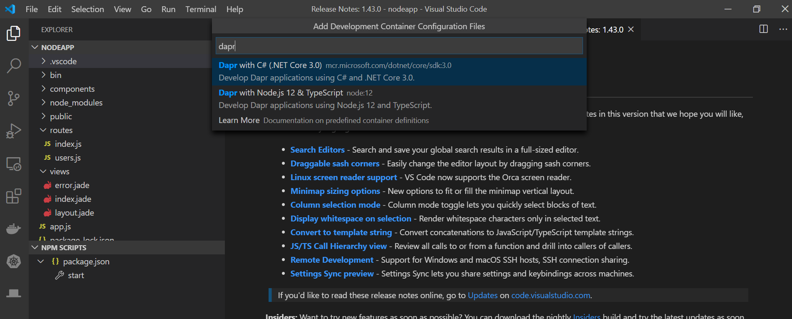

# Application development with Visual Studio Code

## Using remote containers for your application development

The Visual Studio Code Remote - Containers extension lets you use a Docker container as a full-featured development environment enabling you to [develop inside a container](https://code.visualstudio.com/docs/remote/containers).

Dapr has pre-built Docker remote containers for each of the language SDKs. You can pick the one of your choice for a ready made environment. Note these pre-built containers automatically update to the latest Dapr release. 

Watch this [video](https://www.youtube.com/watch?v=D2dO4aGpHcg&t=120) on how to use the Dapr VS Code Remote Containers with your application.

These are the steps to use Dapr Remote Containers 
1. Open your application workspace in VS Code
2. In the command command palette select the  `Remote-Containers: Add Development Container Configuration Files...` command
3. Type `dapr` to filter the list to available Dapr remote containers and choose the language container that matches your application. See screen shot below.
4. Follow the prompts to rebuild your application in container. 

