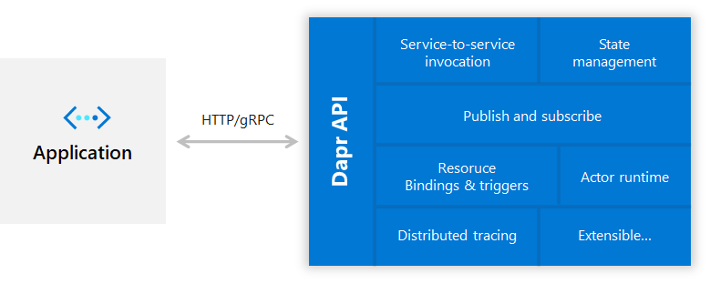
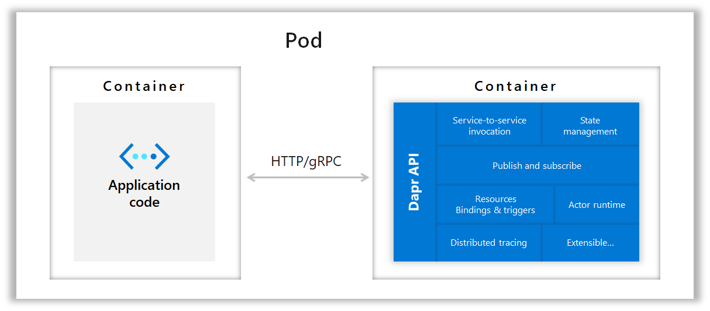

# Dapr overview

Dapr is an open source, portable, event-driven runtime that makes it easy for developers to build resilient, microservice stateless and stateful applications that run on the cloud and edge. Dapr embraces the diversity of all programming languages and developer frameworks. 

## Building event driven stateless and stateful microservice applications

Today we are experiencing a wave of cloud adoption. Developers are comfortable with web + database application architectures (for example classic 3-tier designs) but not with microservice application architectures which are inherently distributed. It’s hard to become a distributed systems expert, nor should you have to. Developers want to focus on business logic, while leaning on the platforms to imbue their applications with scale, resiliency, maintainability, elasticity and the other attributes of cloud-native architectures.

This is where Dapr comes in. Using Dapr you can build stateless or stateful event-driven microservices sending pub/sub events between your services, including to and from external resources. For example, you can build an e-commerce application using stateful actors to represent the cart, calling other functions for payments and checkout, saving state to stores. In an IoT scenario stateful actors, representing digital devices, can publish message to stateless functions that subscribe to these events, as well as pushing event data to queues for offline business processing.  

## Microservice building blocks for cloud and edge
Dapr codifies the *best practices* for building microservice applications into open, independent, building blocks that enable you to build portable applications with the language and framework of your choice. Each building block is completely independent and you can use one, some, or all of them in your application.

The diagram below shows the distributed system building blocks provide by Dapr, exposed with standard APIs. These APIs can be used from any developer code over http or gRPC.

In addition Dapr is platform agnostic meaning you can run your applications locally, on any Kubernetes cluster, and other hosting environments that Dapr integrates with. This enables you to build microservice applications that can run on the cloud and edge.

Getting started is easy with the Dapr CLI. This alpha release includes support for running locally on developer machines, any Kubernetes cluster (including minikube), with other infrastructure platforms such as IoT Edge, and Service Fabric on the roadmap.

Using Dapr you can easily build microservice applications 
using any language, any framework, and run them anywhere.

## What building blocks does Dapr provide?

There are many considerations when architecting microservices applications. Dapr provides best practices for common capabilities when building microservice applications that developers can use in a standard way and deploy to any environment. It does this by providing distributed system building blocks.

Each of these building blocks is independent, meaning that you can use one, some or all of them in your application.  In this initial release of Dapr, the following building blocks are provided in this alpha release;

• **Service invocation** Resilient service-to-service invocation enables method calls, including retries, on remote services wherever they are located in the supported hosting environment.

• **State management** With state management for storing key/value pairs, long running, highly available, stateful services can be easily written alongside stateless services in your application. The state store is pluggable and can include Azure CosmosDB, AWS DynamoDB or Redis among others.

• **Publish and subscribe messaging between services** Publishing events and subscribing to topics between services enables event-driven architectures to simplify horizontal scalability and make them resilient to failure. Dapr provides at least once message delivery guarantee.

• **Event driven resource bindings** Resource bindings with triggers builds further on event-driven architectures for scale and resiliency by receiving and sending events to and from any external resource such as databases, queues, file systems, etc.

•**Distributed tracing between services** Dapr supports distributed tracing to easily diagnose and observe inter-service calls in production using the W3C Trace Context standard.

•**Actors** A pattern for stateful and stateless objects that make concurrency simple with method and state encapsulation. Dapr provides many capabilities in its actor runtime including concurrency, state, life-cycle management for actor activation/deactivation and timers and reminders to wake-up actors. 

•**Distributed tracing** To easily diagnose and observe inter-service calls in production using the W3C Trace Context standard.

## Sidecar architecture 
Dapr exposes its APIs as a sidecar architecture, either as a container or as a process, not requiring the application code to include any Dapr runtime code. This makes integration with Dapr easy from other runtimes, as well as providing separation of the application logic for improved supportability. 

In container hosting environments such a Kubernetes, Dapr runs as a side-car container with the application container in the same pod.

 

 

## Developer language SDKs and integration with developer frameworks 

To make using Dapr more natural for different languages, it also includes language specific SDKs for Go, Java, JavaScript, .NET and Python. These SDKs expose the functionality in the Dapr building blocks, such as saving state, publishing an event or creating an actor, through a typed, language API rather than calling the http API. This enables developers to write a combination of stateless and stateful functions and actors all in the language of their choice. And because these SDKs share the Dapr runtime, you even get cross-language actor and functions support.

Furthermore, Dapr can also be integrated with any developer framework.  For example, in the Dapr .NET SDK you will find Dapr ASP.NET Core integration, which brings stateful routing controllers that can respond to pub/sub events from other services, making ASP.NET Core an even better framework for building microservice web applications.

