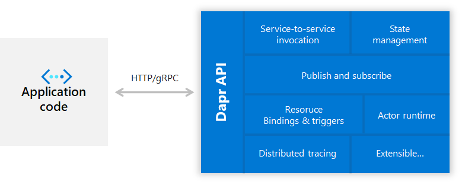
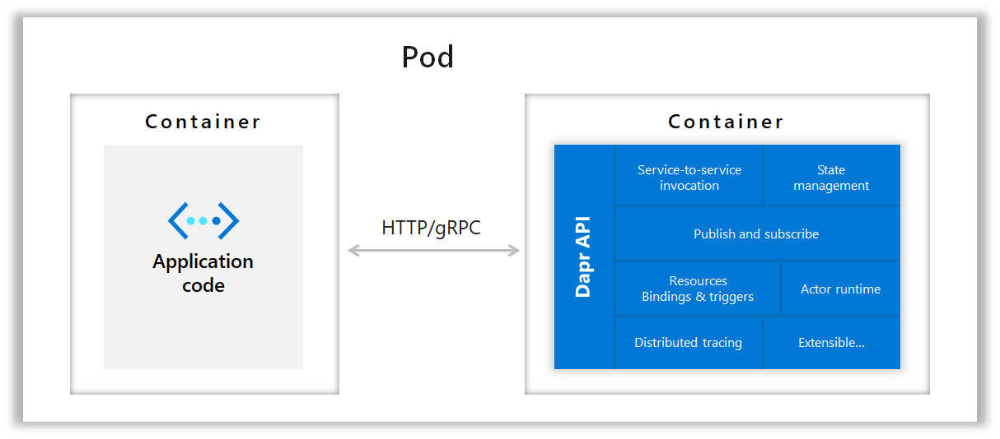
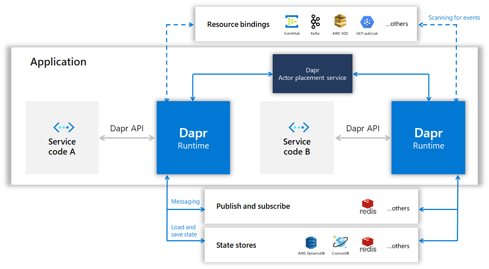
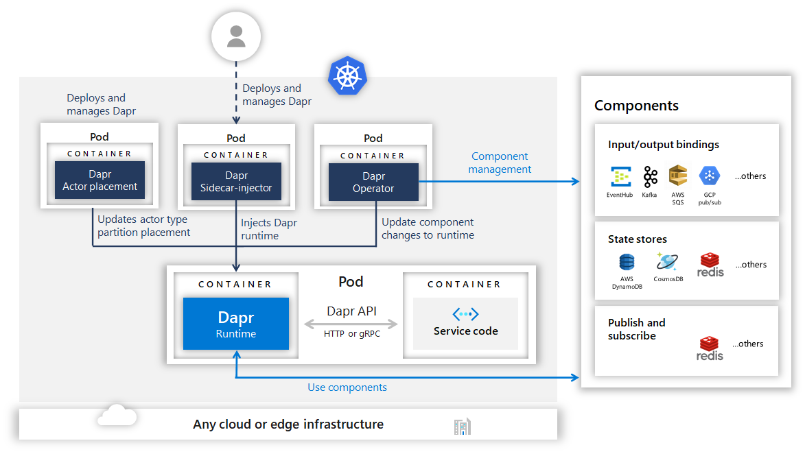

# Dapr Overview

Dapr is a portable, event-driven runtime that makes it easy for enterprise developers to build resilient, microservice stateless and stateful applications that run on the cloud and edge and embraces the diversity of languages and developer frameworks.

## Contents:

- [Any language, any framework, anywhere](#any-language-any-framework-anywhere)
- [Microservice building blocks for cloud and edge](#microservice-building-blocks-for-cloud-and-edge)
- [Sidecar architecture](#sidecar-architecture)
- [Developer language SDKs and frameworks](#developer-language-sdks-and-frameworks)
- [Running Dapr on a local developer machine in self hosted mode](#running-dapr-on-a-local-developer-machine-in-self-hosted-mode)
- [Running Dapr in Kubernetes mode](#running-dapr-in-kubernetes-mode)

## Any language, any framework, anywhere


Today we are experiencing a wave of cloud adoption. Developers are comfortable with web + database application architectures (for example classic 3-tier designs) but not with microservice application architectures which are inherently distributed. It’s hard to become a distributed systems expert, nor should you have to. Developers want to focus on business logic, while leaning on the platforms to imbue their applications with scale, resiliency, maintainability, elasticity and the other attributes of cloud-native architectures.

This is where Dapr comes in. Dapr codifies the *best practices* for building microservice applications into open, independent, building blocks that enable you to build portable applications with the language and framework of your choice. Each building block is completely independent and you can use one, some, or all of them in your application.

In addition Dapr is platform agnostic meaning you can run your applications locally, on any Kubernetes cluster, and other hosting environments that Dapr integrates with. This enables you to build microservice applications that can run on the cloud and edge.

Using Dapr you can easily build microservice applications using any language, any framework, and run them anywhere.

## Microservice building blocks for cloud and edge


There are many considerations when architecting microservices applications. Dapr provides best practices for common capabilities when building microservice applications that developers can use in a standard way and deploy to any environment. It does this by providing distributed system building blocks.

Each of these building blocks is independent, meaning that you can use one, some or all of them in your application. In this initial release of Dapr, the following building blocks are provided:

| Building Block | Description |
|----------------|-------------|
| **[Service Invocation](../concepts/service-invocation)** | Resilient service-to-service invocation enables method calls, including retries, on remote services wherever they are located in the supported hosting environment.
|  **[State Management](../concepts/state)** | With state management for storing key/value pairs, long running, highly available, stateful services can be easily written alongside stateless services in your application. The state store is pluggable and can include Azure CosmosDB, AWS DynamoDB or Redis among others.
| **[Publish and Subscribe Messaging](../concepts/publish-subscribe-messaging)** | Publishing events and subscribing to topics | tween services enables event-driven architectures to simplify horizontal scalability and make them | silient to failure. Dapr provides at least once message delivery guarantee.
| **[Resource Bindings](../concepts/bindings)** | Resource bindings with triggers builds further on event-driven | chitectures for scale and resiliency by receiving and sending events to and from any external | source such as databases, queues, file systems, etc.
| **[Distributed Tracing](../concepts/observability/traces.md)** | Dapr supports distributed tracing to easily diagnose and | serve inter-service calls in production using the W3C Trace Context standard.
| **[Actors](../concepts/actors)** | A pattern for stateful and stateless objects that make concurrency simple with method and state encapsulation. Dapr provides many capabilities in its actor runtime including concurrency, state, life-cycle management for actor activation/deactivation and timers and reminders to wake-up actors.

## Sidecar architecture

Dapr exposes its APIs as a sidecar architecture, either as a container or as a process, not requiring the application code to include any Dapr runtime code. This makes integration with Dapr easy from other runtimes, as well as providing separation of the application logic for improved supportability.

### Standalone

In standaline mode dapr runs as a separate process from which your service code can call via HTTP or gRPC.



### Kubernetes

In container hosting environments such as Kubernetes, Dapr runs as a side-car container with the application container in the same pod.



## Developer language SDKs and frameworks

To make using Dapr more natural for different languages, it also includes language specific SDKs for Go, Java, JavaScript, .NET and Python. These SDKs expose the functionality in the Dapr building blocks, such as saving state, publishing an event or creating an actor, through a typed, language API rather than calling the http/gRPC API. This enables you to write a combination of stateless and stateful functions and actors all in the language of their choice. And because these SDKs share the Dapr runtime, you get cross-language actor and functions support.

### SDKs

- **[C++ SDK](https://github.com/dapr/cpp-sdk)**
- **[Go SDK](https://github.com/dapr/go-sdk)**
- **[Java SDK](https://github.com/dapr/java-sdk)**
- **[Javascript SDK](https://github.com/dapr/js-sdk)**
- **[Python SDK](https://github.com/dapr/python-sdk)**
- **[.NET SDK](https://github.com/dapr/dotnet-sdk)**

> Note: Dapr is language agnostic and provides a [RESTful HTTP API](../reference/api/README.md) in addition to the protobuf clients.

### Developer frameworks

Furthermore, Dapr can be integrated with any developer framework. For example, in the Dapr [.NET SDK](https://github.com/dapr/dotnet-sdk) you can find ASP.NET Core integration, which brings stateful routing controllers that respond to pub/sub events from other services. And in the Dapr [Java SDK](https://github.com/dapr/java-sdk) you can find Spring Boot integration. Others are planned for the future including Django for Python, Azure Functions runtime, Azure LogicApps runtime and server side Blazor.

## Running Dapr on a local developer machine in self hosted mode

Dapr can be configured to run on your local developer machine in [self hosted mode](../getting-started). Each running service has a Dapr runtime process (or sidecar) which is configured to use state stores, pub/sub, binding components and the other building blocks. 

In self hosted mode, Redis running locally in a container, is installed as the both a default a state store and pub/sub message bus components. See the local Components folder for the yaml files.  

The `dapr-placement` service is responsible for managing the actor distribution scheme and key range settings. This service is only required if you are using Dapr actors. For more information on the actor `Placement` service read [actor overview](../concepts/actors). 



You can use the [Dapr CLI](https://github.com/dapr/cli#launch-dapr-and-your-app) to run a Dapr enabled application on your local machine.

## Running Dapr in Kubernetes mode

Dapr can be configured to run on any [Kubernetes cluster](https://github.com/dapr/samples/tree/master/2.hello-kubernetes). In Kubernetes the `dapr-sidecar-injector` and `dapr-operator` services provide first class integration to launch Dapr as a sidecar container in the same pod as the service container and provide notifications of Dapr component updates provisioned into the cluster. 

The `dapr-sentry` service is a certificate authority that enables mutual TLS between Dapr sidecar instances for secure data encryption. For more information on the `Sentry` service read the [security overview](../concepts/security/README.md#dapr-to-dapr-communication)



Deploying and running a Dapr enabled application into your kubernetes cluster is a simple as adding a few annotations to the deployment schemes. To give your service an id and port known to Dapr, turn on tracing information and launch the Dapr sidecar container, you annotate your Kubernetes deployment like this. 

```yml
  annotations:
    dapr.io/enabled: "true"
    dapr.io/id: "nodeapp"
    dapr.io/port: "3000"
    dapr.io/config: "tracing"
```
You can see some examples [here](https://github.com/dapr/samples/tree/master/2.hello-kubernetes/deploy) in the kubernetes getting started guide.
